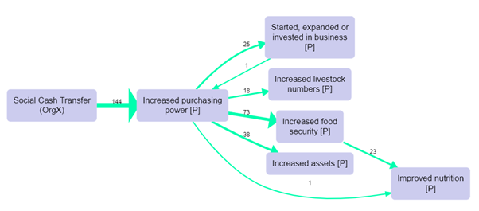
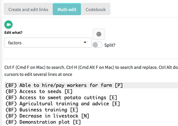
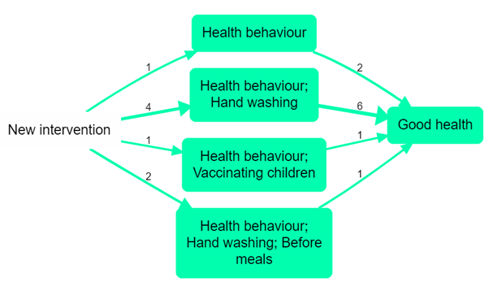
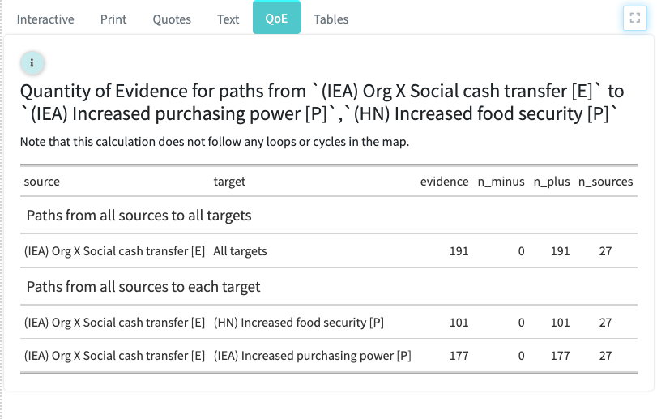
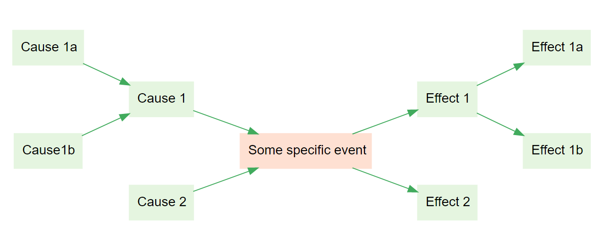
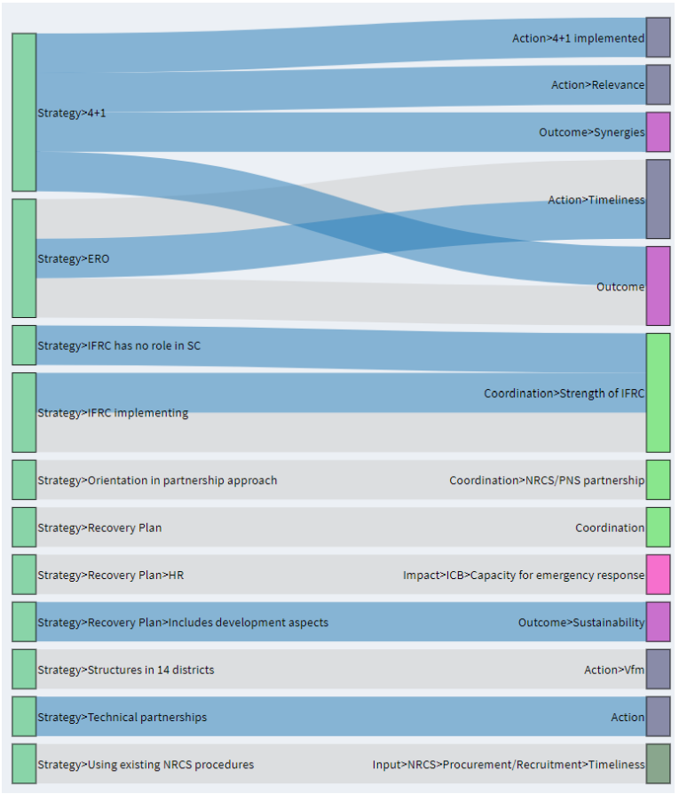

```{r setup,echo=F}
# markroot <- "c:/Users/steve/Dropbox/Apps/Blot/Causal Map documentation"
# markroot <- "c:/Users/steve/Dropbox/Projects/textApp/app/assets/"
markroot <- "c:/Users/steve/Dropbox/Projects/textApp/app/git_assets"

show_mark <- function(fil) htmltools::tags$div(htmltools::tags$p("From the inline help",class="show_mark_p"),shiny::includeMarkdown(file.path(markroot,fil)),class="show_mark")
def_list = list()
thm_list = list()
knitr::knit_hooks$set(engine = function(before, options) {
    if ( before ) {
        if ( options$engine == "theorem" ) {
            thm_list[[options$label]] <<- options$name
        } else if ( options$engine == "definition" ) {
            def_list[[options$label]] <<- options$name
        }
    }
    NULL
}) 

```

# Overview


If you want to find out more about causal mapping and/or the [Causal Map app](https://causalmap.app), this Guide is for you.

The Guide is ideal for people who have already completed the [QuIP](https://bathsdr.org/about-the-quip/) Lead Evaluator training and would like some more background to coding. It is also useful if you are not using QuIP or have never heard of it.

::: {.focus}
💻: This symbol marks sections in this Guide which are specifically about the Causal Map app. The rest of the Guide is about causal mapping in general. The sections about using the app stand alone and can be skipped.
:::

This Guide is in three parts:

1)  Basic causal mapping, corresponding to the features in the Standard package in the Causal Map app.

2)  Advanced causal mapping, corresponding to the features in the Extra package in the Causal Map app.

3)  Spotlight featured articles, Showcase presentations of uses of causal mapping, and FAQs and troubleshooting.

Versions of this Guide:

-   [web version](https://guide.causalmap.app/) (updated most frequently)
-   [PDF](https://guide.causalmap.app/Guide-to-causal-mapping.pdf)
-   [epub](https://guide.causalmap.app/Guide-to-causal-mapping.epub)

<!--chapter:end:index.Rmd-->

# (PART) Outline of Causal Mapping {-}

# Causal Mapping - Definitions and Glossary{#glossary}


## What is a causal map? What is causal mapping?

A **causal map** is a diagram, a graphical structure, in which nodes (which we call "factors") are joined by directed edges or arrows (which we call "links"), so that a link from factor C to factor E means that, in some sense, C causally influences E. Causal maps are used by many research and practitioner teams around the world in a range of disciplines, who employ a variety of methods to construct and interpret them. While one group of such methods is actually called “causal mapping”, there are many similar methods which go by a wide variety of names. 

At the same time, the term "**causal mapping**" is often used as a name for a specific kind of *data collection* method, along with suggestions for analysis. (However, it is possible to have a causal *map* without anyone having intentionally done any causal *mapping*, using information gathered for other purposes.) There are a vast variety of possibilities, with seemingly every author having their own suggestions, from individual interview (Ackermann & Eden, 2004) to reusing open-ended questionnaire questions (Jackson & Trochim, 2002). We distinguish two main kinds of causal mapping:

- Individual respondents are deliberately asked for information about causal links, for example via open questions at the end of a questionnaire or via a series of interviews in which people are directly asked questions of the form “what causes what?” or “what contributed to this event?” For example in QuIP, respondents are asked for causes of changes, and then for causes of the causes, etc. We call this **unmerged** causal mapping because the information from different sources is not yet merged into a single map. When analysing the data, we try to read what the different sources tell us, and bit by bit (“inductively”) try to identify the common elements in their narratives, such as “Health” and “Amount of exercise”. Different respondents will, of course, not always use exactly the same phrases and it is a really exciting and creative challenge to create and curate this list of causal factors: a special kind of *causal* qualitative data analysis. This is your job as causal mapping analyst. For example, if Mo says “Feeling good about the future is one thing that increases your wellbeing”, is this element “feeling good about the future” the same as “confidence in the future” which Sara mentioned? Should we encode them both as the same thing, and if so, what shall we call it? Positive view of future? Does that cover both cases? The Causal Map app is designed for this kind of causal mapping.


- A group of people are deliberately asked about causal links and this information is merged straight away into an overall picture, as a participatory process with the group (Penn & Barbrook-Johnson, 2019). We call this **merged** causal mapping because information from different sources is already combined into one map. The Causal Map app can be useful here too, but it is not its primary use case. 

## Generic terminology for qualitative causal mapping

We collect qualitative data in the form of **text**. 

**Coding** that textual data means **highlighting** pieces of text which express **causal links** (or **causal claims**) between two (or more) **causal factors**. To code a causal link we specify a causal factor at the beginning of the link (“**influence factor**”) and a causal factor at the end of the link (“**consequence factor**”). You create labels for the causal factors, e.g. Increased crop yields. Usually you will start to reuse these same factors to create new causal links as you continue coding.

Some causal claims can be coded as just a single link between two factors like this.

       

In the most basic case, a link means simply that C has some kind of causal influence over D; we could say it makes a **causal contribution** to D, or it **causally influences** D. 

Often we will code a causal claim as a chain like this. These chains are particularly important in QuIP, where we try to trace outcomes back to their drivers: 

 

Sometimes claims are more complex; in general we can call each claim a **causal map** (or a “**sub-map**” to make clear that it is only part of a larger story).

  or   

 

In order to ease interpretation, with a few exceptions, factors should be labelled and understood in such a way that it makes sense to say “more of this” or “less of this” or “this happened” or “this didn’t happen”: we call these semi-quantitative factors. 

These factor names can optionally also include flags: fragments of text, for example, *(Farming).* These should be chosen so they are easy to search for and wouldn’t come up in another factor label to mean something different. General terms, such as *(Farming),* can be used to organise the factors into **themes**. Analysts can also use flags to mark factors associated with specific interventions or project inputs, for example the word “*Intervention*”, as well as to mark factors which are regarded (usually in conversation with the evaluation commissioner) as desirable outcomes, e.g. by using the word “*Outcome*”.  

 

**Causal factors** can also optionally be **nested** within one another. This means for example that it is possible to view **zoom out** to see just the higher-level factors, with their subsidiary factors ‘rolled up’ into them. 

Additional coding possibilities for advanced users (more about these later in the guide):

●    **Hashtag****:** you can use these to make any notes about the *links*, e.g. to note that a link mentions a particular topic or type of statement (e.g. #future) or is a link that you want to review later. Hashtags can use an actual hashtag, e.g. *#hashtag*, but don’t have to, e.g. *hashtag*.

●    **Memo****:** as is standard in qualitative social research, as an analyst you can make short memos of any type on each statement, as well as about each causal link, each factor and the project globally.

●    **Strength** and **actualisation** of the causal link.

 

A useful concept is that of a **bundle** of links, i.e. sets of links which are coterminal, i.e. between the same influence and consequence factors, usually mentioned in different statements by different sources. These can be shown separately or, with certain caveats, together, with a thicker line and/or marked with a label to show the number of links in the bundle. 

Each individual piece of text is called a **statement**, usually this is a sentence, a paragraph or a few paragraphs. Each statement has an ID; a number like 1, 2, 3 etc.

Each statement usually has **additional data** associated with it, e.g. respondent ID number, respondent age, question number. An additional data **field** like “age” usually has various **values**, e.g. 0-20, 21-30. 

We call the set of statements (and possibly the set of respondents etc.) which correspond to a particular value of a particular field a group, e.g. the group of women. 

Usually, statements come from a set of **sources**; in QuIP and in most other kinds of study these are usually *respondents* – individual people or individual focus groups – but in other contexts the statements come from a set of *documents*. Each source is usually associated with several documents. In the app, you can, for example, search for all the statements made by a particular respondent (in the app, the term “source” is used rather than the term “respondent”). 

 

## Formatting in this guide…

We display statements and quotes from them, respondents’ actual words, in quote marks:

“Thanks to the financial support, I can now go to school”

We display factor labels with underlines, like this:

<u>Able to go to school</u>

When we display whole coded causal claims which include an arrow, we don’t use the underlines:

Financial support ➜ Able to go to school 


This first part of the Guide covers all the basic ideas of causal mapping. The second part covers some additional ideas, which correspond to the features enabled for those with "Extra" subscriptions to the Causal Map app.

<!--chapter:end:01000.rmd-->

---
bibliography: references.bib
---

# Causal mapping {#mapping}

> Causal mapping: a way to understand how people think; and perhaps to understand how the world works

## Summary

Causal maps are used by a wide range of research and practitioner teams around the world in a variety of disciplines, from management science to ecology and programme evaluation, who employ a number of methods to construct and interpret them. While one group of such methods is actually called "causal mapping", there are many similar methods which go by a wide variety of names. The aim of this section is to point out the similarities and highlight some of the differences, in the hope that bringing these various approaches into one big tent could increase mutual learning.

This definition *could* cover diagrams representing causal connections between variables which are measured in a strictly quantitative way and would therefore also include a wide variety of important approaches from Structural Equation Models (Bollen & Long, 1993) to the modern and general approaches to causation in statistics centred around Directed Acyclic Graphs (DAGs) and the work of Judea Pearl [@pearl2018]. However the phrase "causal mapping" is usually reserved for qualitative or merely semi-quantitative approaches and we will follow that restriction here, while noting that many ideas from these quantitative approaches have implications for their qualitative cousins (Powell, 2018).

This definition is still very wide, covering as it does applications as diverse as "Theories of Change" in programme evaluation and management, and systems modelling in ecology (Moon et al., 2019). The phrase "causal mapping" goes back at least to [@axelrod2015]), based in turn on Kelly's personal construct theory [@kellyPersonalConstructTheory1955]. The idea of wanting to understand the behaviour of actors in terms of internal 'maps' of the word which they carry around with them goes back further, to Kurt Lewin (Lewin, 1982) and the field theorists. Causal mapping in this sense, used widely in project management and political science, is loosely based on "concept mapping" and "cognitive mapping", and sometimes the three terms are used interchangeably, though the latter two are usually understood to be broader, including maps in which the links between factors are not necessarily causal and are therefore not causal maps.

Literature on the theory and practice of causal mapping includes a few canonical works like Axelrod [@axelrod2015]. Already by 1990 Anne Huff had edited a book presenting some of the wide variety of concept mapping approaches in use in the U.S. at the time (Huff, 1990), including causal maps and argument maps. However, literature on causal mapping tends to be dispersed between disciplines, such that causal mapping is "invented" once again in one discipline or another every few years.

## Causal mapping for evaluators

A causal map is a way to organise a heap of claims about causal links between causal factors. Causal maps allow us to ask and answer questions like "what kind of effect will/did tweaking C make to E?", which is one of the central tasks of programme evaluators. We may be asked

-   if an intervention had, or could have, any effect on some desired outcome.

-   to assess other relevant but unintended consequences of the programme to assess the causal relevance of some intermediate step to some hard-to-measure goal (is this a good step? Are there better steps?)

-   whether C was *the* cause of E.

-   whether C had *some* causal influence on E.

-   what would have happened without some particular assumptions or events taking place

-   is this contribution larger than some comparison contribution

-   is this contribution more valuable than some comparison contribution

-   which are/were the important influences on this outcome

This means that as programme evaluators, we often have to deal with bundles or heaps of claims about causal influences and somehow combine them. For example, we might have some questionnaire data which suggests that an intervention (C) improved teachers' skills in the desired way (D), and we might have some research studies which suggest that this will have a positive impact on student outcomes (E); on the other hand we have an interview with a school director who insists overall that the intervention (C) is useless and did not influence outcomes (E) at all.

Occasionally we may have only one source of information from one method, such as a questionnaire or clinical trial, and we may even believe we have an algorithm which tells us how to make a judgement based on that source, but most often we will have several pieces of information expressed in more or less vague terms, and most often they have to be weighed up and combined based on our own best judgement. To be sure, we can develop some scoring algorithm to help us with that process, but we still need to choose and justify the algorithm. Occasionally an evaluation question can be reduced simply to a question about the *direct* influence of C on E, but most often, as suggested by theory-based evaluation approaches, we have to consider a *network* of causal factors which influence one another, mostly *indirectly* along the paths in the network.

In theory-based evaluation, we may work more deductively, with a pre-existing model or theory; we have to look for evidence for the different links in the theory, revise the theory, and then make evaluation judgements based in part on the revised theory. Or we may work more inductively, developing step by step a theory about relevant causal factors and the links of causal influence between them; this means in particular being able to identify some common causal factors within the different claims in order to combine all this information. Whichever route we take, we will have to make decisions about boundaries (what is part of the model, what is not, and who decides?) and about values (what is good, is this good, is it good enough?).

Most evaluators don't ever physically combine all the fragments of causal evidence at their disposal into one single, composite causal map. But in this documentation we argue that they are still in a sense in possession of a causal map, they just haven't drawn it yet; and perhaps they could, and should. We also argue that it is useful to think of a pile of interconnected causal information as a "map" in the sense of an abstract structure for storing causal information. Such a structure might look like a bewildering hairball if we tried to just print out all of it, but if we know the right rules for doing so, we can print out various *summary* maps and *sub*-maps to help us answer various questions. We also argue that in practice evaluators need software to help them to create, organise and store the different pieces of causal information they collect in the course of piecing together answers to evaluation questions; software which understands the translation rules and can help us with producing the right sub-map or aggregate map to answer a particular question.

The heaps of information which evaluators have to deal with, combined into a causal map, are usually composed largely of number-free judgements like "B makes a considerable contribution to E" or "S believes that E happened entirely because of B". This means that the special set of rules which are available to statisticians when processing entirely quantitative maps are not available to us. So what *do* we do, faced with such a heap of information? Even if we are not conscious of it, we make use of a larger set of generally weaker rules which are still available to us, mostly based in the end on "common sense".

A social scientist might throw up their hands in despair at the vagueness of the information we as evaluators have to deal with: causal factors are not clearly defined, links in maps are ambiguous as to whether they refer to groups or individuals, situations or events; it is not clear whether the claims are eternal or momentary, generalisable or specific, and so on. Yet, decisions have to be made, and information is required, so we do the best we can with what we have.

## Features which causal mapping approaches have in common

### Causality

But in our overall definition of causal mapping, what all approaches share is that a causal map's translation rules have to be **explicitly causal**. As Pearl points out, a genuinely causal arrow can be understood as something like "**if you do C, that will make E happen** (perhaps, with probability p)", whereas, for example, Bayesian belief networks are not strictly causal maps because the arrows say "if you observe C, you will observe E (perhaps with the probability p)". Causation is not correlation.

For Pearl and colleagues, the definitive way to check if C has an effect on E is to intervene in the system, if necessary breaking or disabling any incoming links which might determine C, and tweak E to see what difference just that tweaking makes to E.

C and E can be expressed specifically and uniquely or very generally, or anything in between. But as the claim is causal, the link has to express some kind of causal mechanism which is hardly going to make sense restricted to just one single case.

### Modularity

All these approaches share the basic idea that causal knowledge can be at least partially captured in small relatively portable nuggets of information (like "drought causes hunger" or "mosquitoes cause mosquito bites", something like the idea of a "mechanism"), and that these nuggets can be assembled into larger models of how things work, or at least of how they worked in one or a few cases.

We are for the most part not interested in total or exclusive causation but in causal influence.

## Causal maps as a summary of qualitative data analysis of textual causal claims for each link

Usually when we do causal mapping, we try to listen to (or read) what people tell us, and bit by bit ("inductively") try to identify the common elements in their narratives, such as "Health" and "Amount of exercise" for example. Different respondents will, of course, not always use exactly the same phrases and it is a really exciting and creative challenge to create and curate this list of causal factors. This is your job as causal mapping analyst. For example, if Mo says "Feeling good about the future is one thing that increases your wellbeing", is this element "feeling good about the future" the same as "confidence in the future" which Sara mentioned? Should we encode them both as the same thing, and if so, what shall we call it? Positive view of future? Does that cover both cases?

The possibility of coding links between concepts is mentioned briefly in a well-known QDA handbook (Saldaña, 2015) as a possibility, and the Axelrod school has its own coding manual describing how to highlight areas of text expressing causal connections and code them as links between causal factors, inspired by evaluative assertion analysis

This challenge is central to the overlapping field of qualitative data analysis (QDA), which often makes use of tools like NVivo, Dedoose and AtlasTI. However those tools are designed to capture general concepts like "Wellbeing" but are not as well suited to coding links *between* concepts, which is what we need for causal mapping. We believe Causal Map is the only app which is dedicated to helping you with this task.

## Causal mapping as a form of data collection

"Causal mapping" is often used as a name for a specific kind of data collection method, along with suggestions for analysis. There are a vast variety of possibilities for gathering data for causal mapping, with seemingly every author having their own suggestions, from individual interview (Ackermann & Eden, 2004) to reusing open-ended questionnaire questions (Jackson & Trochim, 2002). All of these methods can be coded using the Causal Map app.

Some examples of data collection modalities:

Individual respondents are deliberately asked for information about causal links, for example via open questions at the end of a questionnaire or via a series of interviews in which people are directly asked questions of the form "what causes what?" or "what contributed to this event?"

A set of documents is gathered (either strictly comparable documents as in a medical meta-analysis, or complementary as in a broader review often known as "deskwork," and criteria are drawn up for which sections are to be analysed (e.g., just the executive summaries).

A group of people are deliberately asked about causal links and this information is merged straight away into an overall picture, as a participatory process with the group (Penn & Barbrook-Johnson, 2019) (Markiczy & Goldberg, 1995).

When interviews are carried out, there are different ways to elicit causal claims, for example:

Backwards questioning about problems as in the "problem tree" approach: respondents are asked about a problem in their lives, and what causes it, and what causes those causes, etc.

Backwards questioning about changes, as in QuIP (Copestake, Morsink, & Remnant, 2019) and (rather differently) in Most Significant Change technique (Dart & Davies, 2003): respondents are asked about changes in their lives recently, and then for causes of changes, and then for causes of the causes, etc.

Forwards questioning about effects, as in iterative scenario planning, and in particular in ParEvo: e.g. people are asked what might happen next, and then what that would lead to, and so on.

Each of these approaches have their own detailed suggestions for how to gather and analyse data.

One popular (and cost effective!) way to source data for a causal mapping study is to reuse existing text data which was gathered for another purpose, in particular open ended questions in surveys, providing data protection agreements allow this.

Of course all of the usual procedures for ethical review, protection of respondents, gaining assent and data protection apply as for any other comparable piece of research.

## QuIP as a form of causal mapping

The QuIP is a form of data collection with some very special features:

-   Interviewers are usually blindfolded to the commissioner and to the specific intervention.

-   Respondents are asked about changes in key domains, generating a backwards chain of causal explanations ("and what influenced that? .... And what influenced *that*?").

QuIP analysis also involves qualitative, inductive coding. The above features have implications for the kind of coding we do. The causal factors in QuIP:

-   deal with actual events which happened to the respondents rather than with general principles

-   usually take the form of changes ("improved" / "decreased" etc).

Finally, in the QuIP we are interested first of all in people's *beliefs* about what causes (or caused) what, constructing a causal evidence map. Only then, as an optional next step, do we consider whether, and how much, we can deduce from that what *actually* causes (or caused) what. In particular, we are interested what we can deduce about causal paths from explicitly and implicitly identified interventions to other specific factors ("Outcomes") which are agreed to be important.

### QuIP: explanations of changes do not themselves also have to be changes

One question which comes up a lot is this: In QuIP, we ask people to describe changes in their lives over (say) the last three years, and then generate a backwards chain of causal explanations by asking "and what influenced that? .... And what influenced *that*?". So, do the *explanations* also have to be expressed as changes in the last three years? For example, someone might say this:

*I know more about water conservation now because of the radio broadcasts sponsored by Organisation X, which we didn't have three years ago. But I also know more because of the local government's agricultural officers who explain things to me. They've been around for ever, and they haven't changed their activities, it's just that I learn something new from them every time I meet them.*

We recommend including the agricultural officers as a causal factor influencing the change in knowledge, even though their activity has not changed.

This means that we also sometimes code factors like "God" and "Unemployment" which are often mentioned as causal influences even though they may not themselves have changed. Of course, we hope that the interviewers have been trained to gently question whether the respondent really means to describe a causal influence and not is not just producing an empty formula out of habit.

If we look at the same question from a perspective of quantitative statistics, we note that if we had data both from three years ago and from now (which we don't), we would indeed observe a correlation between presence of radio broadcasts and knowledge of water conservation. On the other hand, we wouldn't have any correlation between presence of radio broadcasts and input from agricultural officers, because there is no variation in the officers' input; it was the same all the time. This fact might lead us to feel that there is something illegitimate about our recommendation to include the officers' input as a causal factor. We would perhaps like to have data from a parallel world in which there were no agricultural officers over the whole three years, to see whether the knowledge increased, but we don't. But if we think more carefully, we will realise that nor do we in fact have data from three years ago on the radio broadcasts either. What we have in both cases is not a statistical contrast but our respondents' more or less implicit causal claim that it was both the addition of the radio broadcasts *and* the presence (rather than the absence) of the agricultural officers which each made a difference. The validity of people's causal information comes primarily from a whole shared knowledge map gained over time from culture, instruction and experience. For example, it is not usually the case that I think "ooh, my knowledge seems to be going up, what could have caused that?" but rather we are well aware of the causes because we are part of, inside, the whole process, and we know what it is like to gain understanding when and because someone explains something. It is true that this knowledge is sometimes updated using systematic observation of contrasting cases, whether before-against-after, or here-against-there, or even occasionally using experimental manipulation; but this is an important additional option rather than a primary or original source of causal information.

## Advantages of causal mapping

### Induct

Causal mapping aims to directly understand and collate the causal claims which people make in narrative (and other) data rather than trying to deduce causal connections using statistics or some other method. It starts with what people actually say in real-world contexts and does not rely on heavily pre-structured question formats. Urgent, unexpected, and unwelcome information is treated at face value.

In some forms of causal mapping, the map is drawn as a synthesis of the views of contributors in a participatory process. In other forms, like QuIP, each contributor is helped to produce their own map and these maps are synthesised later by an analyst. In either case, the maps do not need to follow any preconceived conceptual framework; types of causal claims are identified inductively and iteratively. This is a partly creative process, however the decisions made during synthesis are transparent as the underlying text is always available.

At least some of the *boundaries* of causal mapping research (what are we going to talk about? What are we not going to talk about?) are set by the respondents, not the researchers.

### Discover

Causal maps work on two levels. On one level, they are presentations of individual and shared cognitive structures, the maps "in people's heads" which are real (social-)psychological things which we need to know about if we want to understand, predict and influence behaviour. On the other level, they are putative, fallible maps of the actual causal world: how things work. Like all other research results, these maps may be wrong, but they usually contain at least some truth. At Causal Map we take a realist stance on both of these levels: the maps in people's heads are real, and the causal world, made up of many causal links between causal factors, is real too.

### Distinguish

It is possible for a causal map to be able to encode both general claims of the form B causes E as well as specific historical claims that B in fact caused E.

### Present

The results of ordinary qualitative research on texts is usually just more text, with maybe some tables of frequency of occurrence or co-occurrence of particular themes for particular respondents, with maybe a chart or even a network graph to present these results. Causal maps on the other hand are not additional presentations of additional analyses but are the main product of qualitative causal mapping. They are relatively intuitive and easy to understand.

### Query

A global causal map resulting from a research project can contain a large number of links and causal factors. By applying filters and other algorithms, a causal map can be queried in different ways to answer different questions, for example to simplify it, to trace specific causal paths, to identify significantly different sub-maps for different groups of sources, etc. With certain assumptions, it is possible to ask and answer questions like "which is the largest influence" or "which is the most positive effect".

### Quote

The original quote or other evidence on which each causal link is based can be stored within the link itself. That means that at every stage of causal mapping, it is possible to directly to return to the story in the original context.

### Reuse

Causal mapping also encourages reanalysis of existing narrative data which is often gathered but left unanalysed. It is highly suited to online use, e.g. gathering narratives via online interview, email, questionnaire etc., reducing airmiles and viral risk. There is no need for a foreign evaluator to travel to gather or collate data.

## When to use Causal Map

So, you've taken a look at the [**features of the app**](https://causalmap.app/the-app/), and you're getting excited about creating maps -- but is your project right for it?

Use Causal Map if you:

-   have a relatively large amount of narrative data (enough to provide at least 20-30 causal links)
-   need help to organise a large number of links and summarise them into an overview or synthesis
-   have information from more than one source (for example different respondents, different documents, or different places in one document) and the information about the source is important to you: they aren't all interchangeable
-   are interested in possible differences between the sources and groups of sources -- and/or you don't necessarily have a preconceived idea of the contents or boundaries of the map.
-   want to capture what your sources actually say, systematically and transparently

Causal Map map is not suitable if you:

-   only have a relatively small map which you can manage with traditional tools for drawing network diagrams (e.g. PowerPoint, kumu.io etc.)
-   need to analyse quantitative data and/or need to do precise mathematical modelling, e.g. of future states of a system under certain conditions
-   would like to sketch out a plan (e.g. Theory of Change or similar) without much reference to the different sources underpinning each link

<!--chapter:end:02000.rmd-->

# 💻 Getting started with the Causal Map app{.hi #starting}

## Prerequisites for using the app

The app is tested on Chrome, Firefox on Mac and Windows, and Safari on Mac, it should work fine on Chrome, Chromium and Firefox on Linux. 

You need a screen with a large resolution, preferably HD or better. It won’t work well on tablet or phone. You will probably want to zoom out to about 80% (in Chrome, press Ctrl – once or twice) to make sure everything fits on the screen. You may also like to view the app "full screen" – how to do this depends on your browser and operating system; on Chrome on Windows, press F11.

As Causal Map is a web application, you will also need a reasonably reliable internet connection. 

## Features of Causal Map

**See** our [pricing page](https://causalmap.app/pricing/).

* Import data (and meta-data about your sources) in different formats
* Code causal claims in the form A –> B
* Code multiple claims at once
* Add memos and hashtags
* Code additional claims as a continuation of previous claim (“chaining”)
* See a summary of all statements from a specific source
* View additional information about each statement (e.g. question and respondent characteristics)
* Create simple or hierarchical factor labels
* Edit many factors and links at once in a powerful bulk editor
* Filter the global map by: Current statement; Factor label; Link (quote, hashtag, memo etc); Statement (text, additional data e.g. respondent characteristics)
* Simplify the map by “zooming out” or showing only most frequent factors or links
* Trace paths from one set of factors to another
* Show maps which are *distinctive* for a specific group e.g. women
* Use the interactive viewer to edit your map
* View and export print-quality maps
* View all quotes for a specific view, and get a smart summary
* Create detailed tables: Factors; Sample; Questions; Differences; Closed questions
* Calculate **Quantity of Evidence** for causal paths between sets of factors
* Download/export your data in different formats
* Automatic additional backups every 30 minutes and restore from a backup
* Share files with others for viewing or editing
* Code additional properties of links like strength and certainty, or mark pairs of factors which are opposite to one another


## Signing up and logging in

Start your journey at go.causalmap.app. The first time you use the app you will see a screen like this:


 Click the “Sign up” link at the bottom and create a password in the usual way. Use the email address corresponding to your subscription.

Check your email (you may need to check your spam folder): you will receive a verification code which you need to type or copy into the app.

Make sure you have typed your email correctly when requesting a password reset. The email field is **not** case sensitive.

Remember to make a note of your password, or let your browser store it for you. You can now log into the app using that password.

You will then see a screen like this:


  


## Choosing files


The files you are able to view, copy or edit are listed in the first box in the file chooser (above), with the ones you viewed most recently listed first. You can just use your mouse to select a file, or, as with all menus like this in Causal Map, you can press your delete key and type to search for files.

In this box you will find at least, depending on your subscription:

·     the file “example-coded”, an anonymised real-life QuIP file which has already been coded. You cannot edit this file, but you can try out different ways to filter and query the causal map. 


·     your own copy of example-coded (or similar), with a name beginning "example-for-you-to-code" with the same narrative data in the form of statements, but with the codings removed. You can edit this file to try your hand at coding.

You can also view other people’s files if they have shared them with you.

From this screen you can also create a new file.


You should then wait for the file to fully load (if it takes longer than a minute, try pressing “Dismiss”).

At any time, you can return to the file chooser, e.g. to switch to a different file, by pressing the File button on the right.


 

## Working collaboratively

If you have more than one login, you can work successively on the same file, but you can’t work on the same file at the same time. 

If Sam opens a file for editing, if it is opened again for editing by same user (Sam) in a different tab or on a different server, or by a different user, then Sam's original version of the file is closed.  This won't result in data loss except minimally if Sam is in the middle of edits e.g. in multi-edit.
Note this only applies to editing the file: there can be multiple viewers but only one editor. 

If Sam uses the app at all with Sam's ID (i.e. email address), if there is any other login with the same ID (by Sam in a different tab or even on a different server, or by someone else), then Sam's original session is closed. This won't result in data loss except minimally if Sam is in the middle of edits e.g. in multi-edit.

These two checks are made every 60 seconds.


## Caveats

The app is still in rapid development – we are adding features continuously. If it freezes, goes very slow or gets disconnected, try refreshing the page.

If you need to refresh the browser cache too, press Ctrl / Cmd shift F5. 

If you the interactive map looks strange, or you can’t “catch hold” of the contents, press the blue Refresh button in the top left of the map.

 

The app saves your *coding work* continuously, you don’t need to press save. But some *other* parts of the app have an “Update” button, remember to press it if you make changes!

Please let us know [hello@causalmap.app](mailto:hello@causalmap.app) if you have any problems. 

## Files

All work at Causal Map is organised into files. A file contains all the data for one piece of work: the text you want to analyse or code, and all the coding you have done.

File names can only be lower-case letters and numbers, and “-“.

## Sharing and access

See the section on the [File button](#sharing).

## Groups

Your user ID (your email address) can be member of one or more groups. 

If you are part of an institutional subscription, or a training group, you will be a member of that group.

The name of your group(s) appears in the drop-downs for selecting other files (see above) as well as the email IDs of the members of the group. You can select the group name(s) and the email IDs of your peers within the group in the access control widget in order to share your file(s) with them. When you share a file with a particular user, they will see the name of that file in the file-chooser drop-down menu.

Groups can also be used to auto-clone group-specific files which are available to all the members of your group, for example for training purposes.

## Guests

If you have an institutional subscription, you may have been given additional guest IDs like guest+1@causalmap.app which are always read-only accounts just for viewing (but not editing) your files. You can give these account details to others, for example a supervisor or commissioner, so that they can view your files. As elsewhere in the app, if one person is logged in with a particular email ID, and then someone else logs in to the app with it, the first person will be logged out. 


## 💻 Overview of the app: The tabs

 

The app consists of several tabs, you can switch between them by clicking on the tabs in the sidebar on the left. The sidebar expands when you hover over it. 


## 💻 Overview of the app: The Code & View tab

You will spend nearly all of your time in the Code & View tab, which is described in this section. The other tabs are described later [See here](#restoftheapp)

### 💻 The navigation bar (at the top)

The file chooser menu on the right shows you all the files you can edit or view. 

- The orange "copy" symbol, <i class="fa fa-copy"></i> to the right of the file chooser, means that you can make a copy of the current file but not edit it.


### 💻 The left-hand panels

You can resize the left-hand panels in relation to the right-hand panels by dragging the right-hand edge of the left panel to the left or right. This edge has a dotted grey line to make it easier to find.

#### Filters

There are various **filters** which can be applied to the maps, quotes, and tables to analyse the data. 

More information on the individual filters can be found later on in this Guide.

   Firstly, if you want to view the dataset as a whole, make sure View statements one by one filter is off by clicking on the toggle (it should turn from green to grey). 


 The Show filters panel should then automatically open. If it doesn’t, click on the toggle (it should turn from grey to green).

 

- You can open and close each filter shown in the filter panel by using the toggles. 

- When you select and apply a filter, the visualisations, quotes, and tables on the right will update. 

- You can apply multiple filters at once. 

- The filter bar will be highlighted in pink if you have applied any filters – always be aware of which filters you have applied and remember to be transparent about these in your reporting. 

```{r,echo=F,class="show_mark"}
show_mark("Interface/show-filters.md" )

```


#### Multi-edit

In the multi-edit pane, you can edit factor names and merge factors, but you cannot delete factors. (This makes sense: if you had factors b c d and you deleted b, it wouldn't know do you really want to delete b or maybe rename b to c, c to d, and delete d.)

```{r,echo=F}
show_mark("Interface/leftcard-Editfactorlabels-tab.md")
```


#### Viewing your statements


```{r,echo=F}
show_mark("Interface/show-statement-pager-combo.md")
```

### 💻 The right-hand panels

There are four main panels which present and visualise the data. More information on each can be found later on in this Guide.

#### Interactive

The interactive map displayed during coding and updates automatically as you code the factors and links for each statement. This interactive causal map displays all the causal links between factors which correspond with your search/filter criteria. You can drag factors around using your mouse to rearrange the map. You can also view the quotes associated any of the causal links by hovering over the arrow that connects the two factors. [See the section 'Viewing the interactive map' for more detail](#viewing-the-interactive-map).

#### Print

Here you’ll find a high-quality static map which is particularly useful for including in reports as it presents the causal stories clearly. See section [See the section 'Viewing the print map' for more detail](#viewing-the-print-map)

#### Quotes

Here you will see a list of all the quotes which correspond to the filters you have applied. This is useful for selecting and copying quotes related to particular stories of change, to include in the report. At the top of the Quotes tab, the most 'typical' sentences of the quotes will be displayed - these should provide a nice summary of the quotes as a whole.

#### Quantity of Evidence (QE)

If you have selected factors in both the “Source Factor” and “Target Factor” filters, the app traces all the paths from the Source factor(s) to the Target factor(s). This panel then calculates for you the *robustness of the argument* that the source factor(s) influence the target factor(s). [See the section 'Quantifying causal evidence' for more detail](#quantifying-causal-evidence)

#### Tables

Here you will find a selection of tables giving information about the factors and links in the current view, and other data associated with them, such as characteristics of the corresponding sample of respondents. [See the section 'Tables in the app' for more detail](#tables-in-the-app)

<!--chapter:end:03000.rmd-->

# 💻 Viewing the Causal Map app{.hi #viewing}

::: {.focus}
This section is just about how to view a file on Causal Map with a view-only account. 
:::

You will be able to:

* See the overall map
* Filter the global map by: Current statement; Factor label; [Link (quote, hashtag, memo etc)](#filtering-the-map-by-link-hashtag-memo); [Statement](#filtering-the-map-by-statement-source-question) (text, additional data e.g. respondent characteristics)
* See a summary of all statements from a specific source
* See additional information about each statement (e.g. question and respondent characteristics)
* Simplify the map by “zooming out” or showing only most frequent factors or links
* Trace paths from one set of factors to another
* Show maps which are distinctive for a specific group e.g. women
* Create detailed tables: Factors; Sample; Questions; Differences; Closed questions
* Calculate **Quantity of Evidence** for causal paths between sets of factors


## Logging in

Start your journey at go.causalmap.app. You will see a screen like this:


You can log into the app using the email and password you have been given.
(Note: the email field is **not** case sensitive)


  


## Choosing files


You will then see a screen like this:


The files you are able to view, are listed in the first box in the file chooser (above), with the ones you viewed most recently listed first. You can just use your mouse to select a file, or, as with all menus like this in Causal Map, you can press your delete key and type to search for files.

You should then wait for the file to fully load (if it takes longer than a minute, try pressing “Dismiss”). 

## 💻 Overview of the app: The Code & View tab

You will spend nearly all of your time in the Code & View tab, which is described further down in this section. 


### 💻 The left-hand panels

You can resize the left-hand panels in relation to the right-hand panels by dragging the right-hand edge of the left panel to the left or right.

#### Filters

There are various [filters](#analysis) which can be applied to the maps, quotes, and tables to analyse the data. 

More information on the individual filters can be found [later on in this Guide](#analysis).

Firstly, if you want to view the dataset as a whole, make sure View statements one by one filter is off by clicking on the toggle (it should turn from green to grey). 


 The Show filters panel should then automatically open. If it doesn’t, click on the toggle (it should turn from grey to green).

 

- You can open and close each filter shown in the filter panel by using the toggles. 

- When you select and apply a filter, the visualisations, quotes, and tables on the right will update. 

- You can apply multiple filters at once. 

- The filter bar will be highlighted in pink if you have applied any filters – always be aware of which filters you have applied and remember to be transparent about these in your reporting. 

```{r,echo=F,class="show_mark"}
show_mark("Interface/show-filters.md" )

```

#### Viewing your statements

```{r,echo=F}
show_mark("Interface/show-statement-pager-combo.md")
```

### 💻 The right-hand panels

There are four main panels which present and visualise the data. More information on each can be found later on in this Guide.

#### Interactive

This interactive causal map displays all the causal links between factors which correspond with your search/filter criteria. You can drag factors around using your mouse to rearrange the map. You can also view the quotes associated any of the causal links by hovering over the arrow that connects the two factors.

#### Print

Here you’ll find a [high-quality static map](#viewing-the-print-map) which is particularly useful for including in reports as it presents the causal stories clearly. 

#### Quotes

Here you will see a list of all the quotes which correspond to the filters you have applied. This is useful for selecting and copying quotes related to particular stories of change, to include in the report. 

#### Quantity of Evidence (QE)

If you have selected factors in both the “Source Factor” and “Target Factor” filters, the app traces all the paths from the Source factor(s) to the Target factor(s). This panel then calculates for you the *robustness of the argument* that the source factor(s) influence the target factor(s). 

#### Tables

Here you will find a selection of tables giving information about the factors and links in the current view, and other data associated with them, such as characteristics of the corresponding sample of respondents. 


<!--chapter:end:03500.rmd-->

# Coding: creating factors and links{#creating}

Qualitative causal mapping involves taking passages of text, e.g. from interviews or documents, and identifying sections which make causal claims. We highlight each of these sections and specify a causal factor at each end of each link (for example Lost job or Went hungry). This means creating a new factor or reusing an existing one. Usually we create these factors inductively as we code, and revise and review and consolidate them as part of the process, as with any other kind of qualitative content analysis. This section is about how to create factors and their labels.

In qualitative causal mapping, the central task is to identify factors and to formulate them in a way which is: 

- easy to understand even without a lot of context

- concise (especially because the labels need to appear in maps)

- suitable for re-use in other causal links

- fits the intended interpretation of the causal links. 

Formulating factor labels is a special case of formulating tags or categories in ordinary qualitative coding. For example some coding assignments are inductive, in which the aim is to identify factors as they emerge from reading the texts, whereas other tasks may be more or less deductive or confirmatory, in which a more or less fixed codebook is given in advance. 

Choosing labels is particularly important when using Causal Map because the labels can do a lot of work for you: 

- they can help “flag” the factor to make it easier to find

- they can help “flag” the factor to put it in a group with other factors

- they can express how a factor is “nested” within other factors. 

In Causal Map, a factor *is* its label. Once you create a label, there is nothing else to add.


 

## 💻 Create and edit links in the app{.hi}

```{r,echo=F}
show_mark("Interface/create-and-edit-links.md")
```

After beginning to create links between factors, one will notice already-coded factors will appear in the dropdown menus in the to and from factor boxes. For added convenience, the most frequently coded factors will appear at the top of this list.

## Formulating labels (semi-quantitative factors)

Remember that in general, factor names are case sensitive. So <u>funding</u> is **not the same as** <u>Funding</u>.

You can use emojis 😍 and other special characters in your factor labels however these **may not be reproduced correctly in exported graphics -- png or svg files which you download from the Print panel**. 


Also, semi-colons ';' you can use them if you want, but note that they have a special meaning in the app.


#### Safe emojis

These symbols are safe to use (you can copy them from here):
▶ ⊕ ⊖ ◨ ◪ ♥ ↺ ֍

These for example are not safe if you want to download pictures from the Print panel:

😙😜😰🤭🐵🐕🐉🦩😍💻 

... but if you don't care about downloading pictures from the Print panel, you can use any symbols you like. Here's a list from [Emojipedia.org](https://emojipedia.org/).

[comment]: # (Incredibly, there are a couple like 🙁 which are ok even in png export but which do not work in epub to pdf conversion and therefore won't work in the Guide)


### Relax! Use heterogeneous, "in-vivo" factor labels

It might be tempting to try to formulate all factor labels in a strictly similar way, using for example language like “increased probability of …” or “positive change in …” in every case. But it is difficult to identify and agree on a satisfactory template for doing this which will capture enough of the way people really make causal explanations (in the way that quantitative social scientists hope to measure everything just with continuous variables). This is always a balancing act, but we encourage you when in doubt to stick fairly close to the actual language your sources use (so-called "in-vivo" coding), and don’t be *too* worried if your factor labels are different from one another grammatically (e.g. some express a difference like “improvement in X” and some do not.  

The formulation of **factor labels** should fit the intended interpretation of the **causal links**. For example, most commonly B ➜ E is supposed to mean that B exerts in some sense an “increasing” or “decreasing” influence on E, then both B and E need to be formulated in a corresponding way. In order to ease interpretation, with a few exceptions, factors should be labelled and understood in such a way that it makes sense to say “more of this” or “this happened as opposed to not happening”: we call these semi-quantitative factors.

Consequently you should avoid a factor label like Training courses, which might be understood as a mixed bag of various causal factors to do with training courses. We would usually prefer a label such as Training courses delivered or Quality of training courses which are easier to understand as things which can increase or decrease, or happen or not happen. You may even prefer to use labels like Quality of training courses improved or Improved quality of training courses, in which the *difference made* is already included in the title. 

### QuIP specific: back-chaining

In QuIP projects, most of the interview material comes in response to questions about changes in the reference period, usually the last three years. QuIP questioning continues back up the causal chain, asking what was the reason for that? … and the reason for that? That means that most influence factors will also be expressed as changes or differences (a change in F is explained by a change in E which is explained by a change in D….), whereas some are not (e.g. “unemployment”). Some analysts will try to avoid coding this kind of claim (can something which has been around a long time explain a change in the last three years?) but you may decide that this distinction does not matter too much. If something really does describe a *change* (e.g. “became unemployed”) then it should be coded. 

Most QuIP testimony begins with questions about whether things have got better or worse, so most causal factors, going back up the causal chain, are likely to be semi-quantitative too. 

### Examples of semi-quantitative factors

These are examples of factor labels where you can judge whether it happened more or less, whether it is higher or lower, or whether it happened versus not happened:

- <u>Sold cow</u>

- <u>Earthquake happened</u>

- <u>(Had) good harvest</u>

- <u>(Level of) bank account</u>

- <u>(Level of) ethnic tolerance</u>

- <u>Quality of seeds</u>

In some contexts, we can also talk about the *likelihood* of events, so “if people get a good harvest they are less likely to sell their cow”.

It is also perfectly acceptable and sometimes necessary to use purely qualitative labels, e.g. coping style, [see below](#examples-of-non-quantitative-factors). However, this may limit some of the analysis and reporting tools available. 

## Opposed pairs of causal factors


What to do when some explanations use a causal factor phrased in a positive way and others use a similar causal factor but phrased the other way around? 

“I feel good because my health is good”.

“My sister lost her job because her health is bad”. 

We could code these:

Health improved ➜ Feel good

Health got worse ➜ Lost job

But we might feel we are missing the fact that the first factor in each case is arguably the same thing, just the other way around.

Solution 1: do nothing

This may mean you find yourself using pairs of opposing factors such as Better health and Worse health to capture the causal claims – things which are in a sense the opposite of one another. You might decide that is fine anyway, because you are happy to have pairs of factors like this, or because you decide that the pair of factors are not really polar opposites at all and therefore you don’t want to combine them. For example, illness is arguably not really simply the opposite of health but a quite different state with its own causal rules. 

Solution 2: merge them

If you use more advanced coding styles involving “strength”, detailed in the “Extra” section of this Guide, you can avoid this by just using one factor like Better health.

## Formulating factors as desirable

If possible, especially when conducting evaluations or research for policy purposes, try to formulate these semi-quantitative factors so that for each one, *more* of it can be broadly thought of as *more desirable*, e.g. Health, Wellbeing; and failing that, as something *undesirable*, e.g. Psychosocial Stress, Mortality. Including factors which primarily code something undesirable as well as factors which primarily code something desirable, is often very natural, but you might sometimes have to think more carefully when making reports and summaries. 

Again, it is least useful, but also perfectly acceptable and sometimes necessary, to fall back to using factor labels which are ambiguous as to their desirability, e.g. Moved house*,* if there is a lack of information or in the case of factors which simply are neutral.

## Examples of non-quantitative factors 


These are examples of factors where it is very hard to quantify the occurrence in any way:

- <u>Teaching style</u>

- <u>Coping strategy</u>

- <u>The content of the report</u>

We call these non-quantitative factors. We might try to reword them as semi-quantitative factors like this:

- <u>Helpfulness of teaching style </u>

- <u>Positiveness of report</u>

 

The diagram below is an acceptable causal map, even though the intervening two variables are an example of more qualitative rather than (semi-)quantitative labels. It tells us that the training did something to the teaching style, which did something relevant to the learning style, which improved student outcomes. We don’t have a theory about the “how” of any of the arrows, and we don’t (necessarily) suggest that teaching style or learning style are things which can be measured on a single scale from e.g. “less” to “more”.

 

## Using flags in factor labels 


Flags are just sequences of characters within a factor label to which you have given a special meaning, and which are unique and easy to search for. These can include letters, emojis or phrases. You can do coding without any such flags if you want, but it can help when searching and filtering.

A quote like “family is better off now because of improved food availability”

 

 

can be coded as a link from the causal factor:

<u>(HN) More food</u>

to the causal factor:

<u>(RW) Improved wellbeing [P]</u>

In this example, three optional flags have been used: the flags (HN) and (RW) are themes which these factors are associated with, [see later](#intervention-flags); and the flag [P] shows that this is a positive outcome. It is specifically marked as desirable. 

Flags like "difficulty*" or “#problem” are good as the additional symbol makes them unique. A flag like “men” is not suitable because it is likely to appear elsewhere (e.g. as part of “women” or “management”). 


### Intervention Flags

The commissioner of an evaluation will nearly always want to be able to focus on their own interventions, so it is advisable to use a consistent label or category across all factors which are noted as project inputs in order to be easily searchable. These will usually be influence factors with no parents, i.e. factors which have no incoming influence factors.

In the example below, both are similar interventions, but one is clearly attributable to an NGO. 

"MSF gave us medicines which healed the children"

MSF gave medicines --> children healed

 

"Someone gave us medicines which healed the children"

Unknown actor gave medicines --> children healed

 

You have a range of options to flag this difference in the label and enable you to filter for all project-related interventions once the data is coded.

·     All such interventions can be labelled with the NGO’s name 

·     If you are doing nested coding, you can nest such factors within a higher-level factor like ‘Interventions;’

·     And/or you can use a specific intervention flag, e.g. #Intervention. (QuIP has its own flags, [I] for Implicit and [E] for Explicit).

You can use any label you want as long as you are sure it is unique, it doesn’t appear accidentally in other factor names, and you use it consistently. 

### Outcome Flags


Similarly, if you wish to flag up outcomes /consequences as either desired/desirable/valued, or the inverse, you can mark these in a way which makes them easy to identify. You could use symbols like ♥ etc. in the labels to designate this, or use use QuIP-style labels [P] for positive and [N] for negative. This can be helpful when undertaking analysis; for example, displaying direct and indirect links from some or all of the intervention factors to some or all of the positive outcome factors or highlighting or counting paths leading to all negative outcome factors, etc. 

Again, you can use any label you want as long as you are sure it is unique, it doesn’t appear accidentally in other factor names, and you use it consistently.

### Coding your statements in context: referring to evidence from elsewhere

When coding data from an interview it is very important to see the whole interview as your source, and not fall into the trap of only coding the statement in front you, out of context. If your statements are split into separate questions (as is often the case with QuIP), it can be misleading to code just one statement in isolation, without taking account of what the respondent says earlier or later in the interview. For this reason we recommend that all analysts read the whole interview before starting to code, and start to formulate causal stories which fit across the whole interview. In some cases, you may prefer to have the whole interview as one statement, and to code it all in one place. This is absolutely possible, and just depends how the data is imported (whatever information is on one row in the .csv file is considered a statement). If, however, the interview is too long, or you would still prefer to code question by question, you need may want to refer to information provided in another statement when coding a link. This is not necessary but can be useful when sharing the file with a commissioner who may look at quotes associated with links, and not understand the rationale for coding without further context. The same applies for different parts of a paragraphs within one statement; you may want to highlight two separate parts of a longer statement.

 

If the quote is not exactly verbatim in the statement, the app won’t let you save anything. (If this happens, just cancel the quote (press the X) and start again.) The app is really picky about this to ensure your quotes are accurate. However, this rule does not apply for anything between square brackets, a useful feature for this case. If the evidence for a link is mentioned in two different parts of a single statement, like this:

*Yes, we got the help from OrgX. Sed ut perspiciatis unde omnis iste natus error sit voluptatem accusantium doloremque laudantium, totam rem aperiam, eaque ipsa quae ab illo inventore veritatis et quasi architecto beatae vitae dicta sunt explicabo. And because of that help, now I have a job. qui dolorem ipsum quia dolor sit amet, consectetur, adipisci velit. Ut enim ad minima veniam.*

You can use square brackets to remove the text you don’t want. Highlight the whole piece of text you want to code, and then edit the quote in the quote window, replacing what you don’t need with […]

*Yes, we got the help from OrgX. […] And because of that help, now I have a job.*

Be careful not to introduce any new text or even spaces.

 

You can also use the same technique to add your own comment or quote from a statement elsewhere in the interview:

*[this is my note] Neque porro quisquam est, qui dolorem ipsum quia dolor sit amet, consectetur, adipisci velit, sed quia non numquam eius modi tempora incidunt.*

Ellipses are also helpful to refer to another statement as part of your evidence:

*[reference to statement 36: The whole village received help from Org X] Thanks to that help we received, we are now growing our own produce.*


## Consolidating and editing factor labels


After you have created more than about 50 factors you will probably feel the need to start consolidating and renaming them and perhaps merging some. 

 

In this map, there are a lot of factors! In particular, there are a lot of *pairs* of factors each of which is used only once, as half of this particular pair, and don’t appear linked into longer stories. These factors are visible in the red box in the diagram. You can find a lot more information about the frequency with which factors are used in the Tables tab. We almost certainly will want to consolidate some of these factors by in some way merging them with others which have similar meaning. 

Suppose you have 100 factors which are just mentioned once or twice. It’s a lot of work to do all that coding, a lot of work for almost nothing, because those very infrequent factors (we call them “tiddlers”) are unlikely to appear much in any reporting you do. With hierarchical coding, even infrequent factors can contribute to the bigger picture.

Before we even think about consolidating factors, do remember the golden rule that, **when coding a new link, always look at your existing factors and try selecting one of those before creating a new one.** Even if you think an existing factor isn’t quite a perfect fit, you can use it and adjust the factor name later. Ideally you will always be able to think of labels for your factors which are at least general enough to cover a few different cases. 

It can be helpful to reformulate factor labels so that some common themes come *first*:

- "communication difficulties - intercultural"

- "communication difficulties - lack of internet"

This is useful when the factors are listed alphabetically and can be a stepping-stone to formulating factors hierarchically.

Even when doing inductive coding, some people formulate factors with a theory in mind, with some higher-level factors like "communication difficulties" or "resilient outcomes". However we have found that it is often most interesting when you let the theory emerge rather than by starting with a preconceived template in this way. Look at your factors periodically as you code and see if there are any obvious groups.

Also, our recommended way of having your cake and eating it - keeping the detail but seeing the general trends too – is “hierarchical coding”. [See below](#simplifying-causal-maps-with-hierarchical-coding). 

### Recoding / merging multiple factors into one


In some cases you will simply decide, in the face of too many factors, to merge

<u>Engagement with communities</u>

and 

<u>NGO engagement</u>

… into one, e.g. <u>Engagement</u>. 

If you have two factors like this which are very similar but not quite the same, you can sometimes keep some detail by using a composite label which explicitly mentions both:

<u>Engagement with communities/NGOs</u>       

### 🖥 How to do this in the app?{.hi}

 ```{r,echo=F}
show_mark("Interface/leftcard-Editfactorlabels-tab.md")
 ```


<!--chapter:end:04000.rmd-->

# Analysis: viewing and filtering the map{#analysis}

Various kinds of software are available to simplify the task of viewing and filtering a causal map, especially for larger maps. For example, gephi.org is a good choice for very rapidly manipulating even very large maps - much larger than Causal Map can handle.

A causal map can be filtered to show only some parts of it. Some submaps are well-known from network analysis, for example the “ego network” for a particular factor is the part of the map which includes only those factors directly connected to it. This is something like searching for that particular factor. 

An related approach is to specify one set of Source factors and another set of Target factors and to display only the links along paths which lead from a Source factor to a Target factor. This is called an “etiograph” in a seminal organisational analysis of Utrecht Jazz Orchestra (Bougon, Weick, & Binkhorst, 1977). 

## 💻 Viewing the interactive map

 

```{r,echo=F}
show_mark("Interface/rightcard-Interactive-tab.md")
```


## 💻 Filtering the map: factors


```{r,echo=F}
show_mark("Interface/show-factor-search-combo.md")
```


## 💻 Filtering the map by link, hashtag, memo...

This filter enables you to search for causal links with certain hashtags, memos or quotes. 


How do I use this filter? 

As with the previous search boxes, simply type/select the hashtag, memo, or quote you want to focus on.


Why would I use this filter? 

Use it to find words or phrases in specific quotes which you have highlighted while coding. And if you’ve added hashtags or memos to causal links during coding, this filter allows you to search for them in the causal map. 

## 💻 Filtering the map by statement, source, question...

 

This filter enables you to filter the causal map to factor in additional data or respondent/source characteristics. 

How do I use this filter? 

Select an additional data field from the dropdown menu Filter statements. The options available will vary depend on the data you have collected, a typical additional data field might be respondent ID, age, or sex, for example. 

Once you’ve selected your field, then type/select the specific criteria you want to filter by (i.e. individual respondent, age category, male/female) into the Filter by… search box. Use the arrows to the right of the search box to toggle between the different options. You can add more than one value (e.g. several age groups or several respondents).

 

```{r,echo=F}
show_mark("Interface/show-statement-search-combo.md")
```

Check the checkbox to the right of the arrows and ‘X’ button if you want to view a map which shows links which are **unique** to your search criteria. For example, by checking the box above, the map would then show causal links that *only* respondent mjf-1 reported – if indeed there are any links that are unique to them, or almost unique to them (they mention them much more often than anyone else). [See later section](#comparing).

 

Why would I use this filter?

This filter is especially useful for understanding the differences between respondents and for selecting case studies to report on. 

Using this feature, you can view a causal map from the female respondents and then compare it to the causal map from the male respondents. You can even view the causal map from a single respondent, which you might choose to present as a case study. 

 

 

## 💻 Viewing the Print map

In Print view, there is a checkbox for "clusters" which groups your factors into strict top-level groups. It is only useful if you are nesting, and sometimes annoying. but now you can use the search box next to it to type (the beginnings of) any boxes you want to make. 

So if you type Intervention, Firms and Impact, three boxes appear just grouping together factors which begin with those phrases, and the factors are regrouped to fit into the boxes.

The setting “layout” makes a huge difference. Usually you will want “dot” layout which lays out your map in a left-to-right direction. 

 

However, other layouts can be useful, for example when you are looking just at the ego network for a single factor, i.e. just the factors immediately adjacent to it, searching just for that one factor and one step up or down, the “circo” layout can be very helpful:

 

This checkbox  hides any tags or other words written between square brackets. So instead of this:


you see this:


<!--chapter:end:05000.rmd-->

# Analysis: path tracing{#tracing}

## 💻 Tracing paths in the app

We already saw how we can use the factor search box to filter the map, and mentioned that we can also search using the “Target” box. When we put text to search for factors in both the boxes, we call this “path tracing”. 

Choose your desired **path length** by selecting a number from the Downstream steps slider.

 

A path length of 1 will only show the one step in the causal chain from/to your chosen factor, i.e. A ➜ B. A path length of 2 will also show the next step in the causal chain (if there is one!), i.e. A ➜ B ➜ C. The maximum path length/number of steps is 8, however, most causal chains are typically shorter than this. 

Why would I use this filter?

This analysis function is a powerful tool which enables you to view full causal pathways and to interrogate the relationships between specific causal factors.

Using our OrgX example, there is a clear causal path from the ‘Social Cash Transfer’ to ‘Increased Purchasing Power’. The complexities of this causal path are best seen and shown by using path tracing, as it simplifies the map and highlights the intervening factors between the two factors. 

Also, path tracing is the prerequisite for calculating the “Quantity of Evidence”, [see later](#quantifying-causal-evidence).


<!--chapter:end:07000.rmd-->

# Analysis: comparing maps between particular groups{#comparing}

## Filtering by respondent group 

We code a causal map on the basis of text data. That text data can be usefully broken up into statements, usually of a length between a paragraph and a page. Each statement usually has "**additional data**" associated with it, for example the ID or gender of the respondent, the text of a question to which this statement is an answer, the page and name of the document from which this statement comes, etc. When we code a causal claim within a statement, we can associate the resulting link with the additional data. That means that for every link, we should know the additional data, e.g. the gender of the respondent, etc. 

We call the set of statements corresponding to a particular value of a particular additional data field a “**group**”. This definition of “group” is quite broad and does not have to refer only to respondents, e.g. the group for “question 3” is the subset of all the data relevant to that question. 

It is easy to filter a causal map by this additional data. This idea goes back at least to (Ford & Hegarty, 1984). For example, here is one map filtered to show all and only the links mentioned by with female respondents. We call these the **per-value maps**, e.g. the map consisting of all links mentioned by women. However, often the maps for different groups are quite similar as a large proportion of links are shared. When there are many links as in this example, the resulting filtered maps can be uninformative. 

 

There may still be a bewildering hairball of links. We can apply techniques like [hierarchical coding](https://causalmapdocumentation.blot.im/simplifying-causal-maps-with-hierarchical-coding) to “zoom out” of the map, or simply show only the most frequent factors. This map shows the top five factors for women: 

 

 

And this map shows only the top five factors for men (there were far fewer men in this project). 


This is disappointing. The maps are almost identical, though the frequencies are different. We might have a feeling that the men’s answers do indeed differ from the women’s, but how can we be sure? Does this pair of maps prove that there are no interesting differences? 

These are important problems:

- Which, if any, features of the map for one group are interestingly different from the map for another? 

- Are there in fact any relevantly different sub-groups within our data? When we have many additional data fields (gender, age, education level, parental occupation, size of village as well as question number, interviewer ID, etc), how can we focus on the most interesting differences? Is it *worth our time* looking at separate maps for different sub-groups like different villages or genders? 

## Showing *distinctive maps* for each group

One solution is to display only features which are distinctive for each group. This means the map for this group, which usually includes all links coded for statements from that group, now excludes any of those links if the factor at each end of the link is not **distinctive** for that group. The factor “increased income” is **distinctive** for men if it is mentioned significantly more often by men than by women taking into account the baseline, i.e. the total number of times men mentioned any factor at all. (For example, maybe there are more men than women, or they talk more, or both.) 

 

A slightly more technical discussion, which can be skipped:

*This means that for binary fields like (gender in this particular study), if there are links from factor F to factor G in the distinctive map for women, there cannot be any links between these factors for men. On the other hand, factor F may appear in both maps even though it is not distinctive for either group, but if it does so this is only because in each sub-map it is connected to a factor which is distinctive for that group.*

*More generally, we look at whether the proportion of mentions of a given factor from a given group compared to all the mentions (i.e. including those by the other values of the same additional data field, e.g. the other villages, the other gender) is significantly higher than the baseline, i.e. the overall proportion of mentions of all factors by this group compared to the other values. Is (Mentions of factor F by this group / Mentions of factor F by all groups) significantly higher than (Mentions of any factor by this group / Mentions of any factor by any group)?*


*Given a filtered set of statements, do the usual calculation to get what links would have been shown in the normal view, i.e. which links are coded in the current statements, i.e. create the variable shown vs not-shown for each link. Group all the links into co-terminal bundles (with the same from and to factor). Create the table which has IDs of bundles in the rows and two columns, the number of shown links and the number of not-shown links within each bundle. Run a chi squared test on this table and mark a bundle as "distinctive" if the standardised residual for the "shown" cell is greater than a given cut-off value.*


This idea takes a bit of getting used to. A distinctive map for a group filters out all links between pairs of factors which are both not distinctive for that group. That is the same thing as saying that it shows all the factors which are distinctive for that group, plus factors which are linked to those factors. 

Why don’t we just stop there, and simply display only the factors which are distinctive for a group? Why do we add factors which they are linked to, even if not distinctive? The trouble is that there might be a factor which was very distinctive for the group, but was not linked to any other factors which were distinctive, and would therefore disappear from the map (or we would have to display it floating on its own, which is not appropriate for a map of causal *connections*). In practice this step does not make much difference, and it is usually acceptable to think of a distinctive map as simply a map consisting of factors which are distinctive for that group. 

It is also possible, especially with smaller maps, that there are no links which are distinctive for a particular additional data field like gender. This suggests that there are no very interesting differences between the groups. It is also possible that there is a distinctive map for one group, e.g. women but not for men, or vice versa.

 


To continue the example, we can follow the algorithm and produce the distinctive maps for men and women. These maps even without any further filtering are interesting and readable in their own right, but as there are around 40 factors in each map, here we show the maps filtered further for only the most frequent factors. 

Distinctive map for women, showing the top seven factors.  



Distinctive map for men, showing the top seven factors, also filtering out a few links with just one mention: 


Here, some of the paths in the map for men, from VSL to Increased savings and thence to Increased assets, would be certainly worth following up, as well as the paths to and from “Increased purchasing power” in the map for women. 

As usual, we should treat the maps just as a gateway into the data, an invitation to read and understand the quotes in more detail and in context.

To repeat, the “distinctive map” for a group is *not* a good summary of everything that was said by that group. It is a good summary of what was said by that group more often than the other groups.

## 💻 Filtering statements and groups for comparisons in Causal Map 


When [filtering statements](#filtering-the-map-by-statement-source-question) it is easy, for example, to show the causal map just for specific **groups**, e.g. the female respondents, for which the additional data field “gender” is equal to “female”: you can cycle through the values using the arrow buttons, and you can flip through the statements for each group using the “previous” and “next” buttons in the statement pager. 

We use exactly the same interface to display distinctive maps too. Once a group is selected in the statement filter, use the slider to show the map **distinctive for that group**.

You can use it to answer questions like: what are the main big stories which the women told us which the men didn't? (Or vice versa.) 

For example, if you filter as usual to show the claims made by women, and then move the slider towards the right, the map starts to get simpler, showing only claims made frequently by women and infrequently by men. The further you slide, the more extreme this filter becomes. 

All the other filters and tools work as usual on maps filtered in this way, e.g. you can search within the distinctive map for women for statements containing a particular word, or you can show only the most frequent factors or links.

The Tables tab now also displays findings based on filters, asking ‘Do the respondents, sections, etc which contributed to the map as currently filtered differ from those which did not contribute?’


<!--chapter:end:08000.rmd-->

# Analysis: metrics

Many different metrics are possible for causal maps overall and for individual factors and links.

## 💻 Tables in the app{.hi .tabset}

There is a selection of tables included in the Tables panel. These tables can help to highlight key factors or differences across respondent groups, which can then be explored further in the causal maps. You can also apply the filters to these tables. 

```{r,echo=F}
show_mark("Interface/rightcard-tables-tab.md")
```

### How do I use the tables?

You can select from the available tables in the select table drop-down menu.


 

Simply turn on Apply filters for the table to use the filters you’ve selected or turn the toggle off for the table to show the entire dataset. 


When you type something in the Source Factor box, the map shows those hits but also factors connected them. In the Factors tables, you can hide these other factors by selecting "Show only factors?". 


Here are some other ways you can adjust the tables for a particular purpose or to suit your own preferences:

- By default, the factor tables display **frequency counts** (e.g. how many times a factor has been applied). However, you can choose to view **respondent counts** (e.g. how many people reported a factor) by switching on the Use source counts? toggle. 

 

- You can also group the rows in the factor tables to show how the data presented differs between various respondent characteristics such as age, education, and sex. Simply select the desired filter from the Group rows filter. 

 

- You can present the tables as a heatmap table by switching on the Use colours? Toggle. The higher the frequency of the count, the darker the colour of the cell will be. The table might take a few seconds to load when this toggle is turned on. 

 

- You can copy the data from the tables by clicking Copy table to clipboard. You can then paste the data in Word or Excel to create your own tables, graphs, or visualisations. You could also screenshot the table if you prefer! 

 

 

### Factors

What does this table show me? 

The factors table presents the factors applied during coding (and which are relevant for the current filters) and the number of times they were reported as an influence factor and/or a consequence factor. 

- From = how many times the factor was applied as an **influence** factor, i.e. leading to another factor. 

- To = how many times the factor was applied as a **consequence** factor, i.e. as a result of another factor. 

- The total represents how many times the factor was mentioned overall. 

- The factors are listed with the most frequent first. 

Why would I use this table?

This table is merely an overview which can help us to understand which factors are reported most frequently, and whether specific factors were more often cited as an influence or a consequence. To fully understand what the factors mean, they need to be seen in the context of the causal stories they appear in. This table can be useful for initial communication with the commissioner about which factor labels have been created and how often they have been applied, but do exercise caution when presenting this data as it only shows the factor in isolation, whereas QuIP is most interested in the relationships between factors. 

 

### Sample

What does this table show me? 

The sample table [without any filters applied] simply lists all of the respondents and any additional data collected about them (sex, age, location, education.) It also shows the interview type (individual or focus group) for each source. When filters are applied, the table will only present the relevant sources/respondents. If you are searching and filtering for a specific factor, this table will update and only show sources who reported that factor. 

Why would I use this table?

In the first instance, this table can be useful to check that all the sources have been imported into the app correctly. The table also provides a summary of the respondents which can be useful for presenting respondent demographics in the report, either in the sampling section or as an appendix. 

### Differences

What does this table show me?

This table is designed to be used alongside the search and filter functions. When you search and filter the map, the differences table will highlight any significant differences between respondent groups, e.g. more men than women reported a particular causal story. 

Why would I use this table?

Rather than comparing maps side by side, this function does the hard work for you by automatically assessing whether there are any significant differences between respondent groups. This is an incredibly valuable tool when seeking to understand whether particular interventions or alternative drivers/influences are affecting respondent groups differently. 

 

### Sections/questions

What does this table show me?

This table displays the text and ID for every question included in the questionnaire. It may also show any other additional data fields which are the same for each question, e.g. questionnaire subsection or question group. 

Why would I use this table?

You may wish to include this table as an appendix in your report or as a reference point for looking up particular questions. 

### QuIP-specific: Closed questions

What do these tables show me? 

There are two tables which provide a summary of the responses to the **closed questions** asked at the end of each QuIP questionnaire domain. The following symbols are used in the tables to represent the direction of change indicated by the response to the closed question:

| **Symbol** | **Direction  of change** | **Example  responses**          |
| ---------- | ------------------------ | ------------------------------- |
| **0**      | No change                | “No change” “Stayed the same”   |
| **+**      | Positive change          | “Better” “Improved” “Increased” |
| **-**      | Negative change          | “Worse” “Decreased”             |

 

The closed questions table gives an overview of how each **individual** respondent answered each closed question. The closed question summary table presents the **total respondent counts** for each direction of change. For every closed question you can see how many respondents reported positive, negative, or no change in that domain. You may wish to search and filter the statements to view only the closed question responses from a particular respondent group. 

Why would I use this table?

These tables provide a snapshot of the overall trends of change across the domains, so they can be a helpful introduction and “easing in” to the findings - before diving deeper into the causal stories! The closed question responses can also provide interesting insights when compared to the open-ended responses, especially in cases where they might differ. 

 

### QuIP-specific: Ranking 

What does this table show me?

This ranking table provides a summary of all the different organisations/individuals cited by respondents at the end of the questionnaire, along with their given ‘rank’. The table shows how many times different organisations were assigned a particular rank. You may wish to search and filter the statements to view only the organisational rankings from a particular respondent group. 

 

Why would I use this table?

This table is usually presented towards the end of the report to summarise the relative importance of the commissioner’s interventions in comparison to other actors. In some cases, this table serves as a reality check for organisations who may be unaware of the impact other actors are having in the lives of their intended beneficiaries. This table can show where there are duplicated efforts by different actors, and where there might be room for collaboration across organisations. 

 


<!--chapter:end:09000.rmd-->

# Analysis: text analysis

 

## 💻 Text analysis in the app

 

```{r,echo=F}
show_mark("Interface/rightcard-Text-tab.md")
```

<!--chapter:end:10000.rmd-->

# Simplifying causal maps with hierarchical coding{#simplifying}

 

## Summary

You can use a separator like ; to create nested factor labels, like this:

<u>New intervention; midwife training ➜ Healthy behaviour; hand washing</u>

We can read this separator as “in particular” or “for example”:

<u>New intervention, in particular the midwife training</u>,

Or we can read it in reverse like this:

<u>The midwife training, which is an example of / part of the new intervention</u> 

Factor labels can be nested to any number of levels, e.g.

<u>New intervention; midwife training; hand washing instructions</u>

The higher level factors can, within the same coding scheme, themselves be used for coding, e.g. we could code “this whole new intervention has also led to happier health providers” like this:

<u>New intervention ➜ Happier health providers</u>

 

We can “zoom out” of a causal map containing nested factors to show a simpler, higher-level structure as a summary. This is done by re-routing links to and from the lower-level factors into their higher-level parents. So zooming out from the 

This then, loosely yet informatively and with certain caveats, accepting a loss of detail but affirming that the overall meaning is not distorted, we can deduce from the first example above the following causal map:

New intervention ➜ Healthy behaviour

Usually these higher-level factors will each be summaries of many lower-level factors.

## Introduction

An analyst coding text to create a causal map is confronted with the same challenge as any qualitative researcher: identifying recurring themes in such a way as to help a larger picture emerge, while retaining important detail. Expressing factor labels in a hierarchical fashion can help solve this problem. But hierarchical labelling also enables a particular strength of causal mapping: it lets us “zoom out” to view a whole causal map from a higher-level perspective, merging causally similar concepts to give a simpler map with far fewer components. Formally, the process of zooming out produces a map which logically *follows* *from*, is *implied by*, the original map. This chapter also introduces a smarter way to “zoom out” from a causal map, and explains how these features are implemented in the Causal Map app.

When conducting qualitative coding of any text, there is always a tension between wanting to keep the detail (e.g. hand washing) but also to code in such a way that general themes emerge (e.g. health behaviour). One way to do this is to organise the codes into a hierarchical structure, so that “Hand washing” is nested as part of “Health behaviour”. This can be done (see e.g. Dedoose, saturateapp.com) by using labels in which the hierarchy is directly expressed, for example “Hand washing; health behaviour” – using semi-colons or some other convenient character to separate the levels of the hierarchy. 

This approach is convenient for several reasons:

- A search for “Health behaviour” will find <u>Health behaviour; Hand washing</u> as well as <u>Health behaviour; vaccinating children</u> and other combinations.

- It can be arbitrarily extended to any number of levels, e.g. <u>Health behaviour; Hand washing; Before meals</u>

- Related items appear next to each other when they are listed alphabetically 

- The hierarchical structure does not require that the analyst (whether using paper-and-pencil or software) maintains a separate set of “parent” codes; the higher-level codes are simply whatever is visible before the semi-colons. Higher-level codes can be created and changed on the fly without having to open a separate codebook or software interface. 

- It is possible to code directly at higher levels, for example using the code <u>Health behaviour</u> where no more details are given. 

When reading a nested factor label aloud, the semi-colons could be substituted with “… and in particular ….”, e.g. “Health behaviour, and in particular Hand washing, and in particular Before meals”. 

The way factor (labels) emerge during causal mapping is just a special case of the way codes emerge in any qualitative coding process, and nested coding is useful in ordinary qualitative data analysis as well as in causal mapping. However, hierarchical coding in causal mapping is particularly exciting because it allows us to do things like simplify a causal map to give a higher-level version of it with far fewer components. 

## Interpretation of the ; separator


A causal map coded using a hierarchical separator can be "zoomed out" given a specific interpretation of the **;** separator, as follows.

If we know 

New intervention; midwife training ➜ Healthy behaviour; hand washing

then, loosely yet informatively and with certain caveats, accepting a loss of detail but affirming that the overall meaning is not distorted, we can deduce:

New intervention ➜ Healthy behaviour; hand washing

and

New intervention; midwife training ➜ Healthy behaviour

and even

New intervention ➜ Healthy behaviour

This actually reflects the dilemma of the analyst: with how much detail should I code the beginning (or the end) of this causal story? Expressing a factor as <u>Health behaviour; Hand washing; Before meals</u> shows that this is indeed to be understood as a kind of health behaviour, although of course not the whole of it. By using this approach, the analyst says: if you are just looking for the global picture, I am happy for this factor to be understood as <u>Health behaviour</u>. 

When factors are nested like this within one another as part of a hierarchy, it is possible to give an overview and ‘zoom out’ of the detailed data. This helps to simplify some of the analysis, enabling the user to focus on the links between the top-level groups rather than all the details. It follows that two factors like “Y; X” and “Y; Z” are *causally similar enough to one another to merge into Y* at a more general level. 

Expressing a factor in a form like "Y; X" **means** it can be replaced as needed with just “Y”, accepting a loss of detail but affirming that the overall meaning is not essentially distorted. If you wouldn’t be happy to accept this replacement, don’t use the “;” to code this factor.

## Semi-quantitative formulations work best


We already saw that causal mapping usually works best when the factors are semi-quantitative. The hierarchical approach also works best when the higher-level factors are themselves labelled such that also they are *semi-quantitative*, *causal* factors which could be used on their own – in a way which themes or categories [see here](#formulating-labels-semi-quantitative-factors) could not. Good examples would be:

- <u>Social problems</u>

- <u>Social problems; Unemployment</u>

- <u>Social problems; Addiction</u>

- <u>Psychosocial stressors</u>

- <u>Psychosocial stressors; Fear of job losses</u>

- <u>Psychosocial stressors; Pre-existing mental health issues</u>

Here, “Social problems” and “Psychosocial stressors” are causal factors in their own right; they are not just themes or boxes to put factors into. 

So we might have:

“The problem of unemployment is a psychosocial stress for many”

Social problems; Unemployment ➜ Psychosocial stressors

 

“When people get stressed they often turn to drugs“

Psychosocial stressors ➜ Social problems; Addiction

 

These could be combined into this story:

Social problems; Unemployment ➜ Psychosocial stressors ➜ Social problems; Addiction

 

If we zoom out of the above story, we could focus in on the higher-level factors and in this case we would get a vicious cycle:

Social problems ➜ Psychosocial stressors ➜ Social problems

## Higher-level factors are *generalisations* 


Usually, we don’t use higher levels merely to organise factors into themes which are not causally relevant. 

<u>Health; vaccinations law is passed</u>

<u>Health; mortality rate</u>

These two items can be grouped into a *theme* “health” but can hardly be understood as special cases of a more general causal factor, so it would be a mistake to use the semi-colon. Instead, it would be more suitable to include the word “Health” just as a **flag**, without the semi-colon. 

In other words, **causal factors in hierarchies should usually be semi-quantitative**.

In spite of what we just said [above](#higher-level-factors-are-generalisations), sometimes you *can* use higher-level factors just to group a mixed bag, like this:

<u>Politics; increase in populism</u>

<u>Politics; shift to the left</u>

<u>Politics; shift to the right</u>

<u>Politics; more engagement from younger voters.</u>

The higher-level factor <u>Politics</u> is not in any sense a generalisation of these very disparate factors. However, we can at least think of it as a ‘mixed bag’. If we roll the map containing these stories up to level 1, we’ll see this ‘mixed bag’ factor Politics as a cause and effect of other factors. It will be a bit hard to interpret, but we can live with it as long as we remember that it is a mixed bag rather than a semi-quantitative summary. 


**All the factors within one hierarchy should be desirable, or undesirable, but not both.**


Generally speaking, make sure that the **sentiment of a more detailed factor is interpretable in the same way as the factor higher up in the hierarchy**. Ideally *all* the detailed factors within a hierarchy should be broadly *desirable,* or all *undesirable*, but not both. For example, you don’t want to nest something undesirable into something desirable. E.g. you don’t want to formulate a factor like this: 

<u>Stakeholder capacity; Teachers; Lack of skills</u>. 

Because capacity would normally be understood as something desirable, and lack of skills would not. Try to reformulate as: 

<u>Stakeholder capacity; Teachers; Presence of skills</u>.

One limitation to this way of expressing the hierarchy as part of the factor label is that you can’t make one factor belong to two different higher-level concepts. For example, you could understand a particular midwife training both as causally part of a new intervention but also perhaps as causally part of an institution’s in-service training programme or an individual’s workload, but you can’t code it as both “New intervention; midwife training” and “In-service training; midwife training” at the same time.  

This limitation is because of the meaning of the semicolon: the ; in "Y; X" means that this label can be replaced as needed with just “Y” , accepting a loss of detail but affirming that the overall causal story is not essentially distorted. If a hierarchical label had more than one parent, we wouldn’t know which parent to "roll up" the factor into.

## Hierarchical coding as a way of coping with a large number of factors


Usually analysts are faced with the quandary of either having too many which they lose track of, or merging them into a smaller number of factors and losing information. With nesting, you can have your cake and eat it; it is similar to the process of recoding an unwieldy number of factors into a smaller number of less granular items, but with the advantage that the process is reversible; the information can be viewed from the new higher level but also viewed from the original, more granular level. For example, we can count that the higher-level factor component “Health behaviour” was mentioned ten times, while retaining the information about the individual mentions of its more granular components.

## Themes


When the analyst wants to group certain factors into a theme (like “health”) which is not itself a causal factor, hierarchical nesting should not be used. Instead, text flags like “#Environment” or “[Environment]” or just “Environment” can be used to create themes simply by adding the text flag to the factor label, e.g. 

<u>Soil loss (Environment)</u>

<u>Eco training courses for NGOs (Environment)</u>

or even a symbol:

<u>Soil loss 🌍</u>

<u>Eco training courses for NGOs 🌍</u>

We can still search and filter with text tags, even with icons, as long as they are unique. This practice has nothing to do with nesting or causal hierarchies, although it can be used in parallel with them.

## Re-usable factor components as text flags


Sometimes your factors relate to each other in ways which are not just hierarchical. For example:

- <u>Activities completed; Training; Health</u>

- <u>Activities completed; Distribution; Health; First-aid kits</u>

- <u>Outcomes achieved; Health; First-aid skills</u>

These are three (hierarchical) factors in which “health” appears in different places. In this example, "Health" appears only as a "component" of other factors. Although on its own it might look like a mere theme rather than a causal factor, it plays a role in differentiating the causal factors in which it participates, e.g. “Activities completed, in particular training, in particular on health”; and because "Health" is used across hierarchies, it functions as a text flag [see here](#using-flags-in-factor-labels) and can be used as part of searches, lists and counts of factors, etc.

Isn’t that a contradiction? Didn’t we just say that “Health” is not to be used on its own as a factor because it is just a theme and is not expressed in a semi-quantitative way? No, because here the word “Health” does not function as only a theme but as a way of differentiating causal factors: all the actual factor labels in which it participates are correctly expressed in a semi-quantitative way. So Activities completed; Training; Health is intended as a causal factor about the extent of completion of activities, in particular training activities, and in particular health training activities.

## 💻 Hierarchical factors in Causal Map

### 💻 Creating labels

Factors can optionally be expressed as part of a hierarchy by using semi-colons. If you want to use a different separator like “>” or “/”, you can change that in the settings.

For readability, it is usual to leave a space after the semi-colon, but this makes no difference to the functionality.

### 💻 Relabelling

In Causal Map, the process of renaming the factors into this kind of hierarchical structure can be conveniently carried out in the “Multi-edit” tab which is a simple text editor where you can edit anything you have created during coding. If you select factors, as in the image below, it will list the currently visible factor labels, sorted alphabetically.

  

Here it is easy to “move” an (incorrectly labelled) factor 

<u>Health behaviour; understanding of germ theory</u>

to something like

<u>Health knowledge; understanding of germ theory</u>

or

<u>Real-world knowledge; health; understanding of germ theory</u>

simply by retyping it, without worrying about whether the corresponding higher-level path (“<u>Real-world knowledge; health</u>”) exists already.

This editor has many features such as global search and replace, and multiple cursors, which make it easy to rapidly edit many factor labels.

Using this panel you can also combine several factors into one and split one factor into several.

### 💻 Additional functionality in the Create & Edit Links panel

Once you have created at least one hierarchical factor, i.e. one with a “;” in its label, the *influence factor* box and *consequence factor* box have some additional functionality to help you. Now, when you start to type, the list of existing factors which you can choose from is extended to include existing factor components, even if they have not (yet) been coded as such. This means:

It gets easier to add new detail to existing or implied higher-level factors.

- Suppose you want to create a new factor “Health behaviour; wearing a mask” and you know there is an existing higher-level factor “Health behaviour”, you can select “Health behaviour” from the list and then just add “; wearing a mask” with a leading semi-colon. These two fragments will be combined into a new factor label. This is quicker and ensures you don’t end up with different spellings of the higher-level factors. 

- It gets easier to re-use existing components at the *end* of your factor labels. For example, you might want to use a factor “Training courses completed; Health” and you already have the factor components “Training courses” and “Health” but not that exact label. You can simply select the component “Training courses completed” followed immediately by the component “; Health” and the two will be combined into a new factor label.

### 💻 Search with nested factors

The same principle applies in the Search and Filter Factors box: you can see factors you have already used but also implied higher-level factors (like “Health behaviour”) and other factor components, beginning with a semi-colon. 

 

 

## Zooming out


  

 

Assuming we have a causal map which has used nested coding, as in the small map shown above, how do we take advantage of this coding to “zoom out”? 


 

If we define the "level" of a factor as the number of semicolons in its label plus 1, here is the same map, zoomed out to level 2 (i.e. a maximum of one semi-colon per factor). 

 

 

Here is the same map, zoomed out to level 1 (i.e. there are no semi-colons at all).

 

**A warning**: for convenience, in both of these diagrams, the set of links between each pair of factors are displayed as one, with a number to tell us how many links there actually are. But most generally, we must not assume that links can in fact be combined in this way without caveats; it could be, for example, that some of them express increasing, and some decreasing, influences. 

Another, related, warning: causal mapping as described here is a *qualitative* process. While zooming in and out can be very useful, it should never be used mechanically. For example, if we had the information “my daughter went to the new training course and now she is quite obsessed about washing her hands, she just won’t stop”, we might code this as “Health behaviour; hand washing; obsessive” but we would certainly pause before zooming out without further thought. Perhaps this new behaviour belongs somewhere quite different. To a qualitative researcher, narrative is not additional colour, but raw data. 

## Smart simplification


A weakness of the above approach is already visible in the example, so simplification goes one step further. In many cases we may be happy to see all the factors “rolled up” to the top level but in the above example, “Health behaviour; hand washing” dominates. “Health behaviour” itself is only mentioned once in the raw data, and there is only one other mention of it as a higher-level component, in relation to vaccinations. What can we do about this? 

Another way to simplify a causal map is just to hide factors and/or links which are mentioned less frequently. Often it is hard to view a full causal map, especially because of the presence of very many of what we could call “tiddlers”: factors with just one or two mentions. But this is unsatisfactory because it throws away information. This won’t help us, but can we combine the two approaches?

A smarter approach is achievable with this simple algorithm: step by step, “roll up” the least frequent factor by one level, and stop when the desired level of generality has been reached, i.e. when the number of remaining factors is satisfactorily small. 

This is an improvement over zooming because it retains detail where it is necessary and removes it where it is not. It will roll up lots of infrequent, granular factors into their parents but only if they are infrequent; if you have a very granular factor like "health behaviour; hand washing" which actually has a lot of mentions, then it won't get rolled up. It will also completely remove infrequent top-level “tiddlers” which cannot be rolled up into anything else. It is also welcome because the process can be stopped at any desired stage to get just the right level of detail.

The above example can be rolled up to this:

 

This is an improvement because it still has a small number of factors, retaining frequently-mentioned factors but wrapping up infrequently-mentioned detail into higher-level concepts. 

Not all causal information is always retained: Infrequent factors which are either already top-level, with no nesting, or which already “contain” a few rolled-up factors but are still infrequent, cannot be simplified further and will be hidden from the map. 

 


## 💻 Simplifying (zooming out, and filtering out less frequent links and factors) in the app

```{r,echo=F}
show_mark("Interface/show-zoom-combo.md")
```

<!--chapter:end:10501.rmd-->

# 💻 The rest of the Causal Map app, tab by tab{.hi #restoftheapp}

The main “Code & View” tab has been described earlier. You will spend nearly all of your time in this tab. In this section we will look at the other tabs and what they do.

## The *Download* tab: Exporting your files

### Exporting

You can always export all your data in different formats at any time using the buttons in the File tab.

## The *File* button

Press the File button at the top right of the app to switch to a different file, restore from a backup, and share and lock your file.


This is what you see when you click the File button:


### Choosing a file

The menu shows you all the files you can edit or view. 

### Merging another file into the current one

If you want to merge another file into the current one, just select the other file from the menu and press `Merge`. 

### Backups

Every time you open a project, an auto backup is made. 

Every time you choose to press “Save”, a different kind of backup is made, called a user backup. 

If you click on "backups" in the File tab then choose a backup, you switch from your current project to the backup you selected. In detail: the current project is saved in the backups folder as "project name_replaced_backup current date and time" and the backup you clicked on becomes the current one with the existing project name. The old backup remains. 

The system saves up to 20 auto backups (usually ones make when you load up at the start), 20 user-created backups when you deliberately press the save_project button, and ten of these "replaced" backups: up to 60 backups altogether.

In summary:

- the app saves your work as you go along. If you just close your browser, you should always find your last coding or edits are restored when you revisit your project later.

- Also, the app makes an auto backup of your file every time you log on. 

- If you are making some changes which you are bit nervous about, or want to record a snapshot, press the save button in the sidebar at any time you want to make a "user backup". 

- The app stores the last 20 user backups and the last 20 auto backups, and you can restore any of them at any time using the File button at the top right of the app. 

### Sharing and locking{#sharing}


Here you can share your file with others.

There is only one editor for each file. So if you want someone else (who also has a Causal Map account) to edit your file, you can use the first control in this box to make them editor. Also, only the editor can change the sharing settings. 

You can add any number of other Causal Map accounts into the "copy" and/or "view" boxes. 

- "Copy" permission means that the other user can make their own copy of this file, which they can then edit.

- "View" permission means that the other user can make only view the file.

You can also use this switch to lock the file. This means that no-one can change it, not even you, until it is unlocked again.


It is also possible to create larger groups of users. Ask us for help with this: hello@causalmap.app. 


## The Upload and Fix tab: uploading and tweaking your data

The documentation is work in progress. 

### Uploading statements and additional data as one file

The only data you need to provide is a table of statements as a .csv file. Your .csv files must have a header row with the names of the fields. 

The statements are the texts which appear one by one by one in the Code & View tab, for you to read and code. Each statement is one row in your .csv file. 

If you want to import interviews which are several pages each, you should break each interview into several statements. Ideally a statement consists of between one and five paragraphs – enough to fit on the left-hand side of the Code & View tab when it is displayed there. Usually your text breaks up naturally into sections, for example the interviews might be responses to a number of questions, so your statements might consist of one or a few paragraphs for each question. 

We strongly recommend that you don’t try to import statements which are longer than 2500 characters or 500 words. It is harder to code very long statements. 

Your statements file must have at least one column with the text of the statements and the header for this column must be “text”. Other columns will be treated as additional data. 

The only required field in your data table is the text of each statement, like this. 

| **text**        |
| --------------- |
| Lorem ipsum ... |
| Ipsum lorem …   |
| Lorem sunt …    |
| Asdf …          |
| …               |

 

However you nearly always have additional information, first and foremost about the source, for example about the respondent who provided the information, or about the context of the information, e.g. if this statement was a response to a question, what is the question number, or the text of the question, or the name of the interviewer. You can think of additional data as just any additional fields in the statements table. If you provide all of these fields when you import your data, that’s fine, there is nothing more to do. For example, you can import the table below instead of the table above. At the moment the app understands only text fields and numerical fields. It will treat dates and currency as ordinary numbers. 

| **text**    | **respondent** | **Village** | **Region** | **Population** |
| ----------- | -------------- | ----------- | ---------- | -------------- |
| Lorem ipsum | 1              | Bigville    | North      | 1000           |
| Ipsum lorem | 1              | Bigville    | North      | 1000           |
| Lorem sunt  | 1              | Bigville    | North      | 1000           |
| asdf        | 2              | Smallville  | North      | 500            |
| …           | …              | …           |            |                |

 

Probably, each respondent belongs to one “village”, each village to one region and each village has one population figure. But the app does not need to know that. 

In each case, the app also adds a “statement ID” field, numbering the statements 1, 2, 3 etc. to help keep track of them. 

#### Preparing and uploading your .csv file

You provide this table, and any other tables you might need,[see below](#viewing-and-manually-editing-your-data), as .csv files. You can save any spreadsheet as a .csv file from Microsoft Excel and other spreadsheet programmes https://www.google.com/search?q=create+a+csv+file.

If your statements have non-Latin characters like à, è, ù, б, ж, etc, the app should reproduce these perfectly, although there may be problems with Print view. In order to work with data with non-Latin characters, you need to make sure your .csv file is encoded in Unicode (UTF-8): the free spreadsheet programs Open Office and Libre Office can do this fine, Excel sometimes struggles.

Once you have prepared your data like this, go to the "Upload & Fix" tab, and then click the green ("Upload") button on the right. You should also unclick "Append" first, unless you are adding statements to an existing file. (Only click “QuIP style” if you are importing QuIP-style data, [see information here](#quip-specific-importing-from-a-quip-spreadsheet).) Navigate to the place where you stored your file in the usual way. 

You should get a message at bottom of screen reporting success.

TIP: We have had reports of occasional errors uploading files which are on remote storage. If you have this problem, try copying the file to your desktop and uploading from there. 

### What are the #SourceID and #QuestionID fields?

If you want the app to recognise one of these additional data fields as source/respondent ID, make sure the header is exactly like this: #SourceID. 

If you want the app to recognise one of these additional data fields as question ID, make sure the header is exactly like this: #QuestionID.

\#SourceID and #QuestionID are used in some features of the app like the tables.

You can also edit the field names later using the Data Fields Editor.

### Viewing and manually editing your data

 

 

The Edit Data table on the right shows you all the statement texts and additional data. 

If you click on “Sources” you will see a subset of this data, just the data for each source or respondent.

If you click on “Questions” you will see a subset of this data, just the data for each question or section.

Remember to press Update when you have finished manually editing data.


#### Direct edits

You can make small changes manually to this table of data by directly typing and/or pasting corrections in the Edit Data table. Double-click to edit a single cell. 

You can paste a selection containing several cells, e.g. from a spreadsheet, if you want, but do check the pasting has succeeded in the way you expected before clicking Update. 

#### Sorting

You can sort the table by clicking on the field headers.

#### Rearranging columns

You can rearrange the columns by dragging the field headers around. These changes are not permanent, but rearranging the columns can be very useful for creating custom tables for reports.

#### Renaming fields

In most browsers, you can also edit the field names by double-clicking on the headers.

#### Deleting rows

You can delete rows by right-clicking on the row or rows and selecting “remove row”. If you delete rows in the Sources or Questions tables, the data will be removed but the source or question ID will remain. It is not possible to add rows (even though this option appears to e available). 

Remember to press Update when you have finished manually editing data.

### Uploading/appending more statements

You can add additional statements to your existing statements by repeating the process above but being sure to click “Append”. If your data includes additional data fields, they will be matched with existing fields if they exist already and otherwise new fields will be imported; NA or “missing data” will be shown for these fields for the *existing* respondents. 

You can also upload additional statements for existing respondents – they might be for example answers to additional questions, or additional answers to existing questions. As long as you click “append”, it is not possible to “overwrite” existing data in this way; all data is treated as new.

### Uploading Source/Respondent and Question data separately

Often it isn’t convenient to provide this whole table yourself. Often you think in terms of smaller sub-tables. For example you might have one table just with the statements and the respondents (say, there are 20 statements per respondent and 10 respondents, so a total of 200 statements), and another table with 20 rows giving information about each respondent, say with just the field “Village” or maybe with more fields. The app can help you combine this data with the statements. Here is an example.

 

Suppose you already uploaded just this table

| **text**    | **#SourceID** |
| ----------- | ------------- |
| Lorem ipsum | 1             |
| Ipsum lorem | 1             |
| Lorem sunt  | 1             |
| asdf        | 2             |
| …           | …             |

 

The app already added an additional statement_id field for you.

| **statement_id** | **text**    | **#SourceID** |
| ---------------- | ----------- | ------------- |
| 1                | Lorem ipsum | 1             |
| 2                | Ipsum lorem | 1             |
| 3                | Lorem sunt  | 1             |
| 4                | asdf        | 2             |
| …                | …           | …             |


(Or, suppose you already imported QuIP data as described elsewhere.) 

Suppose you now have additional information about the **sources**, like this.

| **#SourceID** | **Village** |
| ------------- | ----------- |
| **1**         | Bigville    |
| **2**         | Smallville  |
| **3**         | Bigville    |
| **…**         | …           |

Then you can upload this table as a csv file. The first field is called the key field and its name corresponds exactly to the name of one of the existing fields, in this case, #SourceID. All of the values in that field have to correspond to existing values of the key field. The name of the first column has to be exactly “#SourceID” (or “#QuestionID” if you are in the Questions table, uploading questions).

Upload this data by clicking “Sources” in the data editor on the right (where you will see any existing data for your sources) and then selecting your csv file.

<div class="focus">If you are uploading additional data about *Sources* remember to click the Sources button first. If you are uploading additional data about *Questions* remember to click the Questions button first.</div> 

The app merges the information like this:

| **statement_id** | **Text**    | **#SourceID** | **Village** |
| ---------------- | ----------- | ------------- | ----------- |
| 1                | Lorem ipsum | 1             | Bigville    |
| 2                | Ipsum lorem | 1             | Bigville    |
| 3                | Lorem sunt  | 1             | Bigville    |
| 4                | Asdf        | 2             | Smallville  |
| …                | …           | …             | …           |

 

The procedure is exactly analogous for uploading additional information about your questions, for example question text, or questionnaire section.

You can upload new additional data at any time. Plus, if you want to *change* existing source or question data, you just upload the appropriate new table which overwrites the previous data, e.g. if you find that some of your sources data is incorrect, you can either edit it manually in the table or you can upload a new version of the incorrect table and the old values will be overwritten and any new values, including values in new fields, will be added.

### Downloading Source/Respondent and Question data separately

From the same panels, you can download the data as a csv file. If you want, you can then make larger edits in the csv file and upload the file again as described above. Remember that if you downloaded a table from the Sources table, you must upload it in the same place (click the “Sources” button first); the same goes for the Questions table.


### Additional data: using the fields editor

 

### Additional data: Field names

#### Symbols

In the statement_info panel, and the reports tab, only important additional data fields are shown, in alphabetical order.

In the reports tab, closed questions are visible using blocks as underlying data.

(for compatibility reasons, you can use a number – any number from 0-9 – instead of a #, it will work the same, as long as you use it right at the front, as the very first character. But this is not recommended, and it can’t also be treated as a statement, and you can’t use the other characters.)

If by accident you have multiple versions of the same additional data for the same respondent, the latest version is used, i.e. the one further down your csv file. 

If by accident you have multiple versions of question text for the same question, the latest version is used, i.e. the one further down your csv file.

You can have several statements with the same respondent and question ids, in order to be able to break up a long answer to a single question which is spread out over several statements.


#### Short forms

Sometimes additional data fields may be quite long, for example where it is the text of a question which was asked to prompt the statement. In these cases we may like to see the longer name in some contexts like the info panel, but they are too long in other contexts like the reports tables.

There are three conventions:

1)   If an additional data field name is of this form: 

*Assets -- What is the total value of your assets in dollars?*

then only the part before the *--* is shown in the report (“*Assets*” in this case).

2)   Any text within [square brackets] is not shown in reports.

3)   Only field names which include a number or # will appear in various places in the app as described below.

 

### Fixing data: the tools panel

 

There are various tools for cleaning and fixing your imported data.

 

 

 

### Adding new statements one-by-one manually using the "new statement" button

Note that this way, you don’t enter your additional data straight away. It is more efficient to add it using the Upload and Fix tab. You can do this any time, and all-at-once or in stages.

### Importing from Word or other text files.

#### The easiest way

Each paragraph in your Word document will become one statement, so make sure your Word document is already structured so this will work for you. Delete any double paragraph breaks in Word (i.e. delete any empty paragraphs). If you want some short paragraphs to appear together as one longer statement, delete the paragraph breaks between them. 

Then 

- Copy all the text from your document 

- Create a fresh spreadsheet file in Excel (or LibreOffice Calc or similar) and select cell A2

- Paste your text.

- Type the word "text" as column header in cell A1. 

- Check the statements are the way you want them. You can ignore any formatting, pictures etc which might also have been pasted in because these will disappear in the next step.

- Save your Excel sheet as a .csv file, [see above](#preparing-and-uploading-your-.csv-file).

If you want to include any additional data fields, add them manually as additional columns to the right of your column of text.

Now you can import this csv file into the app as described above.

### Importing from other software

We are aware of the initiative to make qualitative coding software interoperable, https://www.qdasoftware.org/products-project-exchange/. Causal Map has quite a different model and at the moment we don’t provide this, but would do if there is a lot of interest. 

You can always export all your data at any time using the buttons in the File tab.

#### Exporting for import into kumu.io

tbc

#### Exporting for import into NodeXL

tbc

#### Importing existing causal coding

You might already have causal information, for example in the form of node and edge lists, which you want to import. This is not currently possible using the UI: please get in touch.

### QuIP-specific: Importing from a QuIP spreadsheet

This section is specifically about importing from a QuIP-style spreadsheet. This format has many rows, one for each answer, and includes the statements as one kind of answer; you can import statements and additional data from the same fieldwork file. The main differences to a normal import are:

- Rows whose question code does not include a "$" will be imported only as additional data, not as statements.
- A new question ID will be constructed from the question code together with the question text.

First save the main data sheet as a .csv, then press button X to import it. What if you have FGD data too?

Here you can upload all your statements at the start of a file. 

Your csv file must have column headers: 

- `text`, containing the answers
- `#SourceID`, containing the respondent ID 
- `#QuestionID`, containing the respondent ID, 
- `Question`, containing the question text 


Your Question IDs may include the following characters:

A dollar `$` to be treated as a statement

A star `*` to be treated as a closed question.

A hash `#` to be treated as important additional data.

Otherwise your question will be treated as unimportant additional data.

You can mix these, so e.g.

$*# Do you have a house

Will be treated as a statement and as closed question (part of a block) and as important additional data.

#### QuIP-specific: Ranked organisations

This feature is usually used with a QuIP-style import in exactly the format used by BSDR. It may be easier for you to analyse it separately. If you really want to do it in the app, then in order for data to be treated as ranked organisations data,

- The question *text* must end in “ rank” 
- Before importing your statements, make sure the relevant question IDs include a "#".


### Closed questions

Closed question data, common in QuIP studies, are additional data fields which contain closed responses like these:

- better
- get better
- improved


- a bad change
- worse
- no change
- stayed the same

etc. This kind of data is automatically recoded into +, - and 0, and displayed in the Tables panel if you select “closed questions”. 

  


### Importing closed question data, and ranked organisation data, without using QuIP-style import

You can still import closed question data, and ranked organisation data, even if did not use QuIP-style import to upload your original statements. 

Please note that when importing this kind of additional data **with a QuIP-style import**, these answers can *also* be made available as statements for coding if desired. This can be useful particularly if some of the subsequent statements include additional responses to these kinds of questions, so that you can see the original answers to these questions in context. 

In contrast, if you import this kind (or any other kind) of additional data as a normal, non-QuIP-style import, it will **not** also be available as statements for coding. 

To complete this kind of non-QuIP import of closed question and/or ranked organisation data:

1) Import just your statements as usual
2) Then, if you have data on closed questions, import it as an additional .csv file to the "Sources" part of the additional data table, one row per respondent. The first column must be labelled exactly "#SourceID" and contain exactly the same IDs as in the rest of your data. The column headers will be the IDs of the closed questions. These IDs must include a "*" to mark them as a closed questions - you can also add or remove this later. The data in the cells will be text answers like "better", "worse" etc.
3) Then, if you have data on ranked organisations, import it as an additional .csv file to the "Sources" part of the additional data table, one row per respondent. The first column must be labelled exactly "#SourceID" and contain exactly the same IDs as in the rest of your data. The column headers will be the IDs of the ranked organisation questions, which must end in the word "rank". The data in the cells must be of the form `Organisation X - 2` etc, to say that Organisation X received the rank of 2 in this case.


### Appending data

You can continue to upload more data in the same way, remembering to click the “append” checkbox. However, you should only upload datasets containing complete data for one or more individual respondents: don’t upload a partial questionnaire for an individual respondent, or you may get unpredictable results. 

On the other hand, it is fine if the questions are slightly or even completely different for each respondent, e.g. you can finish with individual interviews and then start uploading focus group data, for which some questions are the same and some are different. And it’s OK to have a few respondents who have additional questions just for them.

Don’t use the same question id for different question texts. So for example if you have $A1 for individual interviews “how old are you”, if you want to use a different text (e.g. “what is your average age”) for focus groups, use a different question ID e.g. $A1h (if you used $A1, then “what is your average age” would become the question text for the individuals too). 

 

### Closed questions


You can use the second column in this table to mark a selection of additional data fields as “closed”. [See above](#closed-questions).

 


<!--chapter:end:11000.rmd-->

# (PART) Extra features {-}

# Adding additional information like strength of a link in a causal map: let's keep it simple 

Causal mapping involves modelling people’s causal claims and beliefs as links or arrows between factors. In Part 1 we argued that a causal mapping approach is represented first and foremost by sets of rules which say *how* causal information is encoded by specific features of the elements of the map. In this second Part, we will present some new rules for encoding causal claims within causal maps. We will see that there is no one perfect set of features we can use for encoding all or even a satisfactorily broad selection of all possible causal claims. Even with some quite basic possible features like encoding the “strength” of a causal link, it is not hard to dream up a range of similar but different sets of rules for encoding and manipulating causal maps using this feature. To encode strength of a link, should we use numbers from 0 to 1, or maybe from -1 to +1? If several links point to a factor, should we simply add up the strengths, or use some function which keeps the value of the factor somewhere lower than 1? And so on.

These kinds of problems are common to all attempts to model phenomena. But the problem is particularly acute with causal mapping, especially in causal evidence mapping, where we try to encode many individual claims or beliefs. For example, when viewing actual causal claims we sometimes (but not very often, unless the sources are academics) come across claims about how a set of two or more factors interact to influence another in a way which cannot be captured just by sets of individual links: one of many phenomena sometimes called “non-linear”. For example, "you need fuel AND oxygen AND a spark to get a fire". The trouble is, are we going to activate a whole new set of conventions and rules just to cope with this minority of causal claims? Probably not. 

In practice, we suggest that any one causal map should select an only *one* approach (only *one* set of rules for encoding causal ideas with specific features of the map’s elements) and that this approach should be no more complicated than is necessary to encode most of the causal claims. Mixing approaches within a single map is endlessly tiresome and complicated. It is not a good idea to introduce an additional feature (like "C is necessary but not sufficient for E") just to cope with a minority of causal claims in the map. 


<!--chapter:end:12000.rmd-->

# “Barebones” causal mapping 

In the first part of this Guide we have dealt only with undifferentiated links which simply say “C causally influences/influenced E” or more precisely “Source S claims/believes that C causally influences/influenced E”. We call this “barebones style” causal mapping. There is nothing more to this kind of causal map than links between factors. No other features are used. 

Barebones-style mapping can be interpreted in two different ways:

- As in QuIP, to show causal influences between past events. It is an open question to what extent these causal claims can be generalised. It is possible to parse a link from C to E as saying not only that C is something which has the causal power to influence E but also that in some sense C happened and did in fact influence E, i.e. made a difference to it. 


- To show only causal influences between factors, without recording what did or does happen.  


## Hierarchical / nested coding

In Part 1 e did in fact also introduce an additional convention, hierarchical coding, in which the “;” separator is used to encode the idea that C; D can be read “D, an example of C” and that at a suitable level of abstraction we can approximate C; D as C.


## Combining opposites

This section is work in progress on a simple and powerful way of dealing with “negative” factors and minus influences. 

Here is an example of quite barefoot QuIP-style coding in which we have not used strength at all. Nevertheless there are the beginnings of some ideas about (and issues with) polarity: for example, we have fit and not fit. 

  

I think we've all done this kind of coding, with classic examples being coding for both employment and unemployment or for both health and illness. This could for example be two different stories about two different people; or it could be different aspects of or periods within one person’s life.

This barefoot style on its own is unsatisfactory. The app doesn't know that being fit is represented with a somehow positive and somehow negative factor. It can't join them up. We can’t compare the way that being fit leads to happiness and on the other hand not being fit leads to unhappiness (and to visiting the doctor). **We can’t for example deduce that turning vegan might make visits to the doctor less likely.** Also, if we produce a table or do other analyses focused on healthy habits, we might miss data on the closely related unhealthy habits. (Although the very convention of writing opposites in the form “not Y” as suggested here will help avoid this without any other tricks, as “not Y” will come up in a search for “Y”.)

In this example, we have carefully used the special word “not” to mark out three factors which have explicit (positive) opposites in the same map, in the expectation that they might somehow be combined. 

That’s what this section is about: how might they be combined? 

Note, we are still discussing whether to use not or ~ for this special character:

not healthy habits  

or 

~healthy habits

… we use them interchangeably here. 

The special word “not” (or “~”) may appear at the start of a factor label or at the start of any component in a factor label. This word could be defined by the user – some might prefer a more abstract word or symbol like “X”. Sometimes we have to be a bit clever by inventing formulations like not many jobs versus many jobs. When I say in fact I believe *many existing QuIP studies were already coded in this style without realising it*, I’m taking on board that they probably didn’t actually use this “not” formulation in exactly this form, or not often, but that they could easily and transparently be retyped so that they do, and would still seem fairly natural and “barefoot”. 

(Note that in this example we have also used a little bit of nesting to note the fact that turning vegan and running as well as smoking are health-related habits, but the first two are positive examples of it and the latter is a negative example of it. The “opposites” ideas set out here apply whether or not you used nested coding style; they are particularly powerful when you do but are still very useful without it.) 

When we zoom out the map looks like this:


We have managed to combine the healthy habits into one, but they are still not connected to the unhealthy habits.

A quantitative social scientist might solve this problem by flipping the polarity of the negative examples, coding them as positive but using minus strengths for the connections. So smoking influences good health but with a minus strength. However this always seems somehow unsatisfactory and is complicated to do. It is particularly unsatisfactory when *both* ends of the arrow are flipped in this way so that we code the influence of poor coping on poor health as a plus arrow from coping to health!

The solution presented here can be seen when we just click the “Combine opposites” button. 

            

What happens then is this:

  

Factors expressed in the form “not Y” are combined where possible with factors in the form “Y”. So now there are for example two factors combined into the “fit” factor and two into the “happy” factor. The "not" factors have their incoming and outgoing links preserved, but when a factor is flipped to match up with its opposite, the part of the link next to that factor are now coloured pink. So the lower link from fit to happy is pink because the factor at each end of the link has been flipped from "not Y" form to "Y" form. The 1 means that there is only one such link in this bundle; and the influence factor was originally not fit and the consequence factor was originally not happy. So there is no danger of thinking that this is really just another case of the other link, i.e. of fitness leading to happiness. 

So, a link has two polarities: a *from* polarity and a *to* polarity. Its *strength* is their product (if the signs are the same, it’s a plus, if they are not, it’s a minus). So both arrows from fit to happy have "plus" strength, but they are not the same because one is in a sense a negative example of the other. 

This lower link from fit to happy has the same “plus” strength as the one above it but it does not represent the same information. In fact, **no information is lost when you press the “combine opposites” button; you can still always read off the original map from it.** 

But there is more: the border colour reflects the overall polarity of the factor. The more *plus* incoming and outgoing arrows there are, the greener it is, and the more *minus* arrows there are, the redder it is. If the balance is equal, the border is light grey. If a factor has a red border, that means that at least mostly, its *opposite* was mentioned. So in this example, happy has a grey border because it was mentioned once and its opposite was mentioned once. Fit has a grey border because it has two incoming and one outgoing plusses, and one incoming and two outgoing minuses. 

The total of the numbers on the arrows into and out of a factor is its citation count. But now we have additional information and its citation count is also equal to the number of times it was mentioned in plus form and the number of times it was mentioned in the opposite form. So if we get a big negative net score for employment, there was a lot of talk about unemployment, which we formulated as not employment. 

As this map also uses nested coding, we notice that not healthy habits; smoking has been flipped into healthy habits; not smoking. Not smoking is indeed a healthy habit; and its opposite is mentioned in this story. Hence, it has a red border. 

Here is what this nested map looks like when you also set the zoom level to 1:   


It’s a nice simplification. Those three healthy habits have been collapsed into one factor, which is a bit greenish because it was mentioned more often in its plus form than its minus form (incoming: one + and one -, but outgoing, two + and only one -).

You can see that by default in print view, links in the same bundle, i.e. with the same from and two factors, are no longer always displayed as one, with the frequency noted as a label. (This is obviously a bad idea when some of the links in the bundle may have minus rather than plus strength, etc). Now, the links are only counted together if they have the same *from* and *to* polarities. So there can be up to four different links from one factor to another in Print view. 

We musn’t confuse sentiment or desirability with polarity. Here, worrying is maybe a bad thing but it is shown green, because we haven’t taken the trouble to formulate it as something like not peacefulness. We could do that, but we aren’t forced to. We can use these "not" formulations just if we see there is an opposite idea somewhere else in the map and we want to let the app combine the two for us, in particular in order to be able to make those important and obvious, if tentative, deductions (like, maybe turning vegan leads to less visits to the doctor) which escape us otherwise. If we don’t choose to do this, or even if we miss the obvious opportunity to do so, nothing bad will happen.

 

We are deliberately **not** falling Into the trap of somehow trying to aggregate the different *strengths* to say for example "hey there are 6 plus links from advocacy to compliance and 1 minus link so this is like 5 plus links because 6 - 1 = 5". We don’t have evidence for an aggregated strength; we have aggregated evidence for a strength. Aggregating different pieces of *evidence* for links with different strengths is not the same as aggregating links with different strengths.

 

It’s also possible that someone says “I know this intervention works not only because the intervention made me happier but also because I saw the people who didn’t get it and they are definitely not happier as a result”. In this case, we might code both arrows, intervention ➜ happy and not intervention ➜ not happy.

It’s remarkable here that this “overall polarity” of a factor – was it mentioned more in its positive form than in its negative form – also in a way gives us the kind of information we previously discussed in terms of "actualisation". It is still possible however that we might want to explicitly code actualisation, or the lack of it, for example we might have a whole study which only deals with theoretical information (in which case we might set the actualisation to zero everywhere) or we might have a normal evaluation study in which we occasionally have to code causal claims which are not based on any specific evidence but are merely cited as theoretically true (in which case, we might set the actualisation to zero just for these specific claims). 

### 🖥 How to combine opposites in the app?

The Combine Opposites button is part of the Simplify panel, and the Print view responds to it. 


To make it easier to create a factor which is exactly the opposite of an existing factor, you can select the existing factor in either dropdown when coding, and then press the 


We have not yet clarified how to best make this work for the tables and for Quantity of Evidence.

 

 


 

## Actualisation

In causal maps, sometimes it is enough that your links simply mean that “this influences/influenced that”, but sometimes you need richer ways to capture the relationship between causal factors. 

- Actualisation: rather than simply noting its existence, we also record the fact that this causal connection **actually happened.**

In the simplest version of QuIP coding (Copestake et al., 2019) you don’t need to think about these concepts, so you can either **skip this section**, or read it to understand how simple approaches fit into a more general framework.

 

There are two traditions of causal mapping, each of which has an undifferentiated (yet different) interpretation o

*Floods, which damage crops, didn’t come so had no influence on crops (Actualisation =0)*

*Floods, which are usually good for crops, came but it turns out they have no influence on these new varieties; no influence on crops (Strength =0)*

 

Remember that using multiplication implies, in particular, these rules:

●    Anything × NA = NA

●    Anything (apart from NA) × 0 = 0

The examples below include a quote, a suggested causal connection with factors in italics, and suggested strength and actualisation codes, where the default of Increasing would **not** be used.

“Illegal surface mining in forest reserves is really driving deforestation a lot”

Illegal surface mining ➜ Forests thrive

Strength=Decreasing (-1)

Actualisation=Increasing (1) DEFAULT

The *negative* *strength* (*decreasing*) indicates that mining makes forests thrive *less*, negating the positive nature of the factor label. 

"The Task Force is like a revenue collector, but a few of the forestry staff want to extort money from these people. I understand their challenges, but we tell them to do the right thing by observing the laws, but sometimes they flout the laws."

Gov: corruption/patronage ➜ Gov: Thorough enforcement of regulations

Strength=Decreasing (-1)

Actualisation=Small Increasing (.5)

The *strength* is negative (*Decreasing*) because corruption means ***less\*** thorough enforcement. However, the respondent says this is only true ‘sometimes’, so the *actualisation* – the extent to which this actually happened is small, therefore we use Small Increasing. 


<!--chapter:end:12100.rmd-->

# Compatible and incompatible factors in storylines

Sets of diverging storylines can also be seen as examples of causal maps, as they are networks of events or situations connected by links which are at least in a weak sense causal.

What happens when stories diverge in ways which could be either mutually compatible or mutually exclusive? 

Example: a scenario starting with Trump's nomination as Republican candidate in 2024. Leading on from that you might have (a) a branch in which he's actually elected for a second term and leading on in turn from that you'd have many nodes which are dependent on his election e.g. issuing various orders. And likely you'd have another branch (b) in which he is not elected, building on which you'd have other nodes. Plus, you might have two other branches starting with (c) he issues an order on fracking and (d) he issues an order on space travel.

Now branches A and B are incompatible, whereas C and D are not. In many traditions of causal mapping you'd actually want to combine A and B into one node but somehow make the arrows coming out of it have in some sense opposite polarity. I'm not saying you should, I'm just pointing out that A and B are in a sense two opposite sides of the same coin.

There is a way to look at this kind of divergence in terms of the structural properties of graphs: separating hierarchical clusters. The branches going off from A and B are likely to have little overlap, whereas some nodes in the other pairs of branches might be thematically more similar to one another. To be sure, in a scenario-building approach like ParEvo you aren't going to get stories literally recombining, but they might be close in content. I think there's a reference here to the "hieclust" algorithm as presented by Ackerman and Eden.

There's something fundamental about the difference between A and B: These sets of nodes just don't feature in one another's universes. Whereas, with a more compatible divergence, they're all still in a sense part of the same world.

<!--chapter:end:12150.rmd-->

# Certainty and trust 

In causal maps, sometimes it is enough that your links simply mean that “Source S claims that this influences/influenced that”, but sometimes you need richer ways to capture the relationship between causal factors. 

- Certainty: Source S is certain, or not so certain, that C influences E.

- Trust: the analyst has reason to believe that this particular claim, or all claims from source S, is particularly trustworthy or untrustworthy.

In the Causal Map coding style, we record this information for each link using just one attribute: “Certainty”. 

In the simplest version of QuIP coding (Copestake et al., 2019) you don’t need to think about these concepts. Behind the scenes, the app records Certainty = 1 for each link, but you don’t ever need to see or think about that. In the Causal Map app, just code a link and everything “just works”, so you can either **skip this section**, or read it to understand how simple approaches fit into a more general framework.


<!--chapter:end:12200.rmd-->

# Quantifying causal evidence

## Summary{.hi} 

In the app, in the Quantity of Evidence / Robustness of Argument panel



This tab appears when "Trace" is switched on in the Search and Filter Factors panel. 

It calculates how much evidence there is for the causal path(s) from the factors identified in the From box to the factors identified in the To box. It identifies how many pieces of evidence (individual mentions of individual links) would have to be deleted so that there is no longer any path from the From factors to the To factors. A larger number means more evidence; more pieces would have to be deleted until we gave up the hypothesis that the From factors influence the To factors at all. 

This number is shown in the "Evidence" column. A large number does *not* necessarily mean that this path is *strong* in the sense that the From factors have a *large* effect on the To factors. It says there is plenty of evidence for the path, *whatever its strength*.

Subtotals are provided for each From factor; it can be useful to compare the amount of evidence for the impact of each From factor.

## Problem

**How to summarise, given a heap of causal information about what causes what, the \*quantity\* of evidence that one particular factor influences another particular factor?** 

Conventional approaches calculate the influence on the Outcome of tweaking the Driver, which follows standard definitions of Impact and is the right way to do it when you have quantitative variables.

One of the pioneers of causal mapping, Toulmin, was interested in the structure of arguments and asked what makes an argument plausible or reasonable (Toulmin, 1979). 

 

 

We arrive at a map like this simply by drawing an arrow for every evidenced causal claim that driver D causally influences outcome O. For each arrow, we have for example a separate sentence or paragraph in a document or interview transcript. In this case it is easy to count the evidence: there are three pieces of evidence that D causally influences O. 

To be sure it is interesting that two pieces of evidence come from one source, and one piece comes from another; we don’t want to lose sight of this fact, it might be important, but nevertheless the overall number three is important too. 

In this example we have no further important information to distinguish the “how” or “why” of each causal claim. If there had been further important information about, say, the mechanism or route in each case, then we would have captured this by including additional causal factors, for example additional influences or intervening stages. 

In real life, the situation is normally more complicated. An evaluator is usually confronted with a heap or web of fragments of argument about how a driver might influence an outcome. The point of this paper is to extend our simple intuition above (“there are three pieces of evidence”) about how to *count the quantity of evidence* to cases with intervening causal factors as in the next diagram.

 

*A causal evidence map in which the quantity of evidence that Our Driver influences Outcome = 6, and quantity of evidence that Some Other Driver influences Outcome = 1.*

Sometimes you can just glance at a map like this and see for example there are many lines straight from a driver to an outcome, and we can say “obviously there is a lot of evidence that the driver influences the outcome”. In this case, we can even say “obviously there is a lot more evidence that our intervention can causally influence the outcome than that other driver can”. But how can we formalise this, how can we “count” threads of evidence which may pass through multiple intermediate factors? How do we count the paths, especially when there are many of them and we can’t just “look and see”? (And later we will see that even in simple cases with just a few links, when some links may have a negative or “minus” influence, our ability to “just see” the answer is even more limited.)

 

*A causal evidence map in which quantity of evidence that Driver influences Outcome = 1.*

Here we propose the metric “quantity of evidence”, which can be thought of as the resilience of the web of arguments: what is the minimum number of causal claims you would have to *delete* in order to break any possible argument that D influences O? If your whole argument rests on a single link from K to L, even though you have many pieces of evidence from Driver to K and from L to Outcome, your argument would break if just that one link failed – hence, the quantity of evidence is just 1. 

It turns out that this number is the same as asking “how many completely separate paths (i.e. paths which don’t share any stretches at all) could we construct from D to O?”.

The rest of this section is quite technical and can be skipped.

## Prior strategies

The problem of how to combine (sets of) causal claims has been addressed many times. Pose normative questions (how should/could groups make decisions?) and descriptive questions (how do groups actually make decisions). 

As far as we know, all solutions have been based on the idea of calculating values of the factors by propagation along the links. 

(B. Chaib-Draa & Desharnais, 1998; Brahim Chaib-Draa, 2002), based on the work of Zhang, (W.-R. Zhang, Chen, & Bezdek, 1989; W. R. Zhang, 1994) shows a way to combine different sets of claims using NPN logic. Factors take one of eight values like “neutral or negative” (Nadkarni & Shenoy, 2001) use Bayesian networks which as noted by Chaib-Draa are not suited to maps which include loops or cycles. 

## Definitions

We note that a first attempt to quantify amount of evidence would be simply to count all the different possible paths, i.e. (above) Driver ➜ B ➜ K ➜ L ➜ P ➜ Outcome, Driver ➜ C ➜ K ➜ L ➜ P ➜ Outcome, etc etc. In the above case, counting like this, there would be 3×4 = 12 paths. Yet it is easy to see that just one cut between K and L will break any and all the arguments, so 12 seems too many. 

**A better solution is proposed here based on the network property "maximum flow rate". It is intuitive, and easy to understand and calculate.** 

Note, we are not aiming here to draw any conclusions about the *strength* of the influence which the driver has on the outcome but about the *quantity* of evidence that there is *some* influence. 

Also, everything we say here comes with the caveat “all other things being equal”: we are dealing only with the role played by the bare existence or non-existence of causal claims and their number, without regard to other, surely relevant issues like sources of bias, or context, etc.

This is in fact the situation we are mostly in with the Qualitative Impact Protocol (QuI: a simple pile of causal claims from relatively homogenous sources with little other information which might influence which claim to prefer.

Before looking at the solution, we’ll need to make a surprising distinction: QuIP maps, and some Causal Map maps, and Axelrod’s original maps, are mostly not causal maps but maps of *causal evidence,* or *causal evidence maps*.

## Definition of causal map

A **causal map** (CM) is defined as usual: a network formed by a set of directed edges aka **links** between pairs of nodes aka (causal) **factors**. Usual network conventions apply:

\-     each factor appears only once; 

\-     there are no isolated factors with no links;

\-     we only allow *one* link between any pair of factors. (If there are different mechanisms at work, we prefer to have the additional causal factors which govern these distinct mechanisms explicitly included in the map.)

Semantics: an edge D ➜ O means “D causally influences O”.

There are many possible kinds of causal map. Special cases would include SEMs, some project theories of change, FCM and others.

## Definition of causal evidence map

A **causal evidence map** (CEM) is a set of directed edges aka links between pairs of nodes aka (causal) factors; each link has the property “source ID” and may have additional properties.

Semantics: an edge D ➜ O means “**source S claims** that D causally influences O”.

 

A causal evidence map based on evidence from two sources.

Axelrod’s original maps (Axelrod, 1976) are CEMs. His interest is in studying the decision processes of political leaders, usually just single sources; sometimes he calls them “concept maps” but also “causal maps”.

## CM vs CEM

A CEM has two possible tasks: 

1)   Simply to report what people think about what causes what. 

2)   To help us (perhaps) draw conclusions about what causes what, which can conveniently be expresses as a causal map with the same or similar structure. One of the main tasks of a programme evaluator – or a judge – is to make the leap from CEM to CM: from “Expert source S told me that D ➜ O” to, with caveats, "D ➜ O". 

So the most interesting task is the second: a CEM helps us draw conclusions about a closely related CM. 

QuIP is explicitly involved in both these tasks.

## Multiple links / number of mentions

We have specified that CMs are not allowed to have more than one link D ➜ O. For CEMs on the other hand, it is *usual* to include several links between pairs of factors, in order to encode the fact that different sources mentioned that link.

We will trivially extend CEMs with a **convention**:

\-     a map with n links D ➜ O is equivalent to the same map in which the n links are replaced by a single link with the additional property “Number of mentions” = n

In visual displays, often the number n is displayed on the link. So the diagram above can be converted to this:

 

## Solution

Now we can suggest a solution to the problem above.

### Base case

All other things being equal, we can formalise our intuition about the quantity of evidence provided by CEMS like this:

\-     **any non-zero number of links** from D ➜ O in a CEM **is** **some kind of evidence** that indeed D actually influences O – from a Bayesian perspective, some information is better than no information

\-     **more links mean more evidence**, 

\-     and (all other things being equal), given a CEM with n links from D ➜ O and m links from F ➜ O, if n>m we would say that the **evidence is stronger** that D influences O than that F influences O. Note this is *not the same as saying that we have evidence that D to O is a stronger influence*; we haven’t even introduced a notation for strength of influence. Quantity of evidence for an influence is not the same as evidence for the strength of an influence.

In practice, all things never are quite equal, and it is the job of the human evaluator to review this kind of evidence to see which, if any, conclusions about real-world causality can be drawn on the basis of a causal evidence map. 

Following these intuitions, we can define **quantity of evidence** for D ➜ O given a simple CEM consisting only of D, O, and n links between them as simply n.

 

A causal evidence map; quantity of evidence that D ➜ O is 3.

### Problem: extend this simple case to maps with intervening factors between D and O.


### Useful reporting metrics

\-     Overall quantity of evidence for the paths from all drivers to all outcomes

\-     Individual quantity of evidence from each driver to all outcomes

\-     Comparison of quantities of evidence from a pair of drivers (or sets of drivers) to all outcomes

\-     Individual quantity of evidence from all drivers to each outcome

 

 

 

**
**

 

### Extension: weighting

It is also possible to extend the semantics such that *Quantity of evidence / Number of mentions* can also be used to confer a weighting, such that for example claims from some particular sources, for example focus groups or experts, are immediately encoded with QE =2, opening also the possibility of non-integer (but still positive) QE like .5. 


<!--chapter:end:12500.rmd-->

# Interesting Features

## Summary

Coming soon


<!--chapter:end:12600.rmd-->

# (PART) Additional material {-}

# Spotlight: Causal Mapping and Outcome Harvesting

Causal mapping and Outcome Harvesting can complement each other in a number of ways, combining the particular strengths of OH, such as a clearly documented way to identify and validate specific claims of important changes, with the particular strengths of causal mapping, such as understanding how simple contribution/outcome stories can chain together into a bigger picture.

One way is to use causal mapping after an OH process, perhaps focusing on a subset of the data. [presentation in preparation]

Another way is to use causal mapping when OH has already been used for monitoring, to assemble provisional material and help identify possible outcome statements for further validation. 

<!--chapter:end:13000.rmd-->

# Spotlight: Context in causal mapping: how to code it

In this section, we’ll look at “Context” as it appears to us at Bath SDR and at Causal Map when we do actual (qualitative) causal mapping: taking causal claims which real-life stakeholders actually make and trying to encode them in as systematic a way as possible. We believe that doing qualitative causal mapping is a really good testbed for theoretical ideas in evaluation and social science: do they fit with what people actually say?

So, how do we code this in causal terms: “When enough oxygen is present, a spark will always cause a flame”? (How) can we distinguish between a context like Oxygen and just some causal factor like Flame? How do we encode a context in a causal map?

We can draw a line from Spark to Flame, but what do we do about Oxygen? Drawing a line also from Oxygen to Flame doesn’t seem to capture the context-ness of Oxygen. 

 

*Version1: context is just a causal factor*

In general terms this diagram is ok, because we know the *partial* function from Spark and Oxygen to Flame:


| Oxygen | Spark | Flame |
| ------ | ----- | ----- |
| Yes    | Yes   | Yes   |
| Yes    | No    | No    |
| No     | Yes   | ?     |
| No     | No    | ?     |

We know how Spark controls Flame only *given* Oxygen, but not when there is no Oxygen. This suggests that we can deal with a contextual factor as an ordinary causal factor, namely one which causally enables causal link(s) between other factors.

This *lack* of information about what happens in the *absence* of the contextual factor means that it acts like a *sufficient* condition for the causal relationship. (The defining characteristic of a sufficient condition is that no claim is made about what happens in its absence, just as the defining characteristic of a necessary condition is that no claim is made about what happens when it is present (only when it is absent). 

Inside the context Oxygen, Spark is a necessary and sufficient cause of Flame (or so our respondent tells us). Outside the context C, Spark never makes any difference to Flame (or, we have no information about the effect, which isn’t the same thing, but it doesn’t matter here.)

Perhaps it is this very absence of information about what happens with no Oxygen which makes Oxygen feel more like a context rather than an ordinary causal factor. You can’t see that in this first diagram. 

There are many ways to encode contextual information in a Causal Map; here we suggest storing the information inside each link.

  

*Version 4: context is a causal factor which causally enables any causal link which has the same colour*

In this version, the contextual information is explicitly encoded within each link which is affected by the context. 

- It is quite a general solution, because it can cope with a wide variety of cases. 

- If there are several links which are all active in the context “Oxygen”, they would all get the same colour. 

- If “Oxygen” appears in the map as a causal factor, it could get the same colour; this approach is possible also if the context is never also mentioned as a causal factor, but the colour would have to be explained in another way.

- Visually it is a bit disappointing, because there is no causal arrow coming out of Oxygen, you have to make the visual connection yourself via the colours.

- This approach only works if we think of context as an all-or-nothing thing, which is rarely the case in real life: in fact, in our very example, the contextual role of Oxygen obviously differs according to its strength.

## 🖥 Using context in the Causal Map app

At the moment, you can encode context in the Causal Map app simply by creating a hashtag for it. You can use a family of hashtags by using some characters in common, like “Context:”, like this: 

- Context: Oxygen

- Context: Science_Experiment

At the moment, all hashtags are printed on the Print map. You can also search by and filter for contexts. 

<!--chapter:end:14500.rmd-->

# Spotlight: Beware the transitivity trap

>For want of a nail the shoe was lost, 
>For want of a shoe the horse was lost,
>For want of a horse the rider was lost,
>For want of a rider the battle war lost, 
>For want of a battle the kingdom was lost,
>And all for the want of horseshoe nail.

(Thanks to Gary Goertz for remembering this one!)

## The transitivity trap

One of the key features of causal maps is that you can draw inferences, make deductions, from them. One of the most exciting is to be able to trace causal influences down a chain of causal links. BUT, when you are drawing conclusions from causal maps, beware of the transitivity trap: 

from 

>1) B → C 

and 

>2) C → E 

we can only conclude 

>3) B → E *in the intersection of the contexts of 1 and 2*

... and in general with any causal mapping, you'll never be sure that these two contexts do intersect. You actually have to look at each chain and think about it, and hope you've been told all the relevant facts.  


For example:

If 

>1)  Source P [pig farmer]: I received cash grant compensation for pig diseases (G), so I had more cash (C) 

and 

>2)  Source W [wheat farmer]: I had more cash (C), so I bought more seeds (S) 

can we deduce 

>3)  G → C → H

and therefore

>4) G → S

(cash grants for pig diseases lead to people buying more seeds)?

No, we can't, because the first part only makes sense for pig farmers and the second part only makes sense for wheat farmers. 

There are thousands of different kinds of transitivity trap. It isn't just a problem across subgroups of people. It can apply for example in different time frames. 

If 

>1)  Child does well in year 13 (A) → Child has improved academic self-image (C)

and 

>2)  Child has improved academic self-image (C) → Child does better in year 9 (D)

can we deduce 

>3)  A → C → D

and therefore

>4) A → D

(child doing well in year 13 leads to child doing well in year 9)?

Of course not - even though these claims might be true of the same child. The problem arises as soon as we generalise one causal factor to apply to different contexts. We have to do this, to make useful knowledge. But there are always pitfalls too.

## Not just a problem for causal mapping

This is also true, isn't it, of any synthetic research / literature review? 

And in statistics, knowing the effects from B → C and C → E means you can calculate the indirect effect of B on E but not the direct effect. You have to have additional data just for that. This is one source of various so-called paradoxes in statistics. 

## Can we mitigate the trap with careful elicitation protocols?

Sometimes, we might know that all the information in one particular chain came from the same source, and all this information was explicitly given as a series of explanations of the factor which was initially in focus. But even here, we have to be careful. We might have to ask again, having reached the end of the chain, "did B really influence C which influenced D which influenced E? Was this all part of the same mechanism?" Are we sure we know exactly what we mean by this, and are we sure that our respondents do too?

In any case, part of the point of causal mapping is the synthetic surprises which we can discover by piecing together fragments of causal information which were *not* necessarily provided in this way. This is the situation every evaluator is in when piecing together information from, say, experts for Phase 1 and experts for Phase 2. We just always have to be aware of the transitivity trap. 


<!--chapter:end:14700.rmd-->

# Spotlight: Cases, variables and percentages in causal mapping?

In causal mapping we tend to in most cases steer away from any kind of "75% said ..." statements. It isn't just that we don't tend to use representative samples. 

The point is deeper, namely that most sorts of causal map, the concept of a variable and even the concept of a "case" is a bit vague. In a causal map in general, even one combined from individual inputs, you don't have a clearly defined "case", and correspondingly you don't have clearly defined variables, which makes it more radical and less structured than, say, the world of QCA. 

Some causal maps are elicited as a group consensus about high-level variables like “economic growth”; others are constructed such that all the causal factors represent variables at the level of the individual respondent such as “improvements in nutrition in my household”. Some QuIP maps are however heterogeneous in this respect. The causal chains in individual stories are random walks. Maybe respondent R mentions a factor like “flooded fields” somewhere in a causal chain but respondent S mentions it nowhere. From this we cannot conclude that flooded fields were not a factor in any causal link for respondent S. We don’t even know if respondent S has fields which might get flooded. If they do, are they specific to this respondent or are they shared across a whole village? Part of a village? In this kind of causal map, our sense of what is a “case” is quite vague, and it is also, correspondingly, difficult to think of the causal factors as variables which are defined for every case. We can only find out whether a causal factor really is a variable which makes sense for each respondent considered as a case (or perhaps for some other set of cases, such as “school which the respondent’s children attend”) by reading the narratives and constructing the cases and variables for ourselves.
This soft approach to cases and variables make causal mapping idea for what are sometimes called “complex” situations or systems. However it makes it more difficult to report some kinds of metrics and draw some kinds of inferences from causal maps. 

 
that mean that for the other 16, agriculture was not a cause? Not really. Not even if we assume that our analysts identify and name common factors between respondents perfectly. This vagueness becomes even clearer as we go further up the chain - what about the 4 who mentioned a link between gender roles and agriculture, and the 20 who didn’t?

The reason that even the notion of cases partly breaks down is because while households by all means may always answer on the individual level (“My household / my crops / my attendance at training” etc.) but often in fact they name causal factors which do not live on this level (like “My village’s water supply / roads”) or even things like “the new law” or potentially non-changes like “Unemployment.” Suddenly, the households are not loci of varying information but loci of opinions about things which do not vary at household level - and often they may be something in between (“roads in my half of the village”; “for us pig farmers..”).
 


More generally, in a causal map drawn up from, say, a literature review, the questions of whether there are any variables or cases is something which only gradually emerges / gets constructed. Sometimes we might find that some areas of a map start to contain cases and variables (perhaps we have data from several similar schools), and perhaps there are different such areas, and they might even overlap (perhaps we have data concerning mothers and data concerning fathers). 


<!--chapter:end:14800.rmd-->

---
bibliography: references.bib
---

# Spotlight: Different kinds of question chaining, with QuIP and ParEvo as illustrations

We can build a causal map by just asking people, separately or together, for causal statements around a theme.

But there are many advantages in doing this more systematically -- to make sure we get the right information, and to make sure we have data which we can interpret.

discusses two methods - constructing causal links between a pre-determined set of causal factors using pair comparisons, and instructing respondents to draw a free-form causal map.

One way to build up a causal map systematically is "question chaining". For example we can ask respondents about the causes of an event, and then the causes of those causes, and so on.

## Four options with Fixed versus Variable question chaining

+----------+----------------------------------------------------------------------------------------------------------------------------------------------------------------------------------------------------------------------+------------------------------------------------------------------------------------------------------------------------------------------------------------------------------------------------------------------------------------------------------+
|          | Backwards                                                                                                                                                                                                            | Forwards                                                                                                                                                                                                                                             |
+==========+======================================================================================================================================================================================================================+======================================================================================================================================================================================================================================================+
| Fixed    | Please give causes/reasons for event or situation X; then give causes/reasons for those causes/reasons, etc. (example: -- what were the causes of / reasons for Brexit, etc.)                                        | Please give consequences of event or situation X; then give consequences of those consequences, etc. (example: [**ParEvo**](http://parevo.org) -- read this sentence describing the situation in the USA now, then suggest consequences of it, etc.) |
+----------+----------------------------------------------------------------------------------------------------------------------------------------------------------------------------------------------------------------------+------------------------------------------------------------------------------------------------------------------------------------------------------------------------------------------------------------------------------------------------------+
| Variable | Please name one or more X's, then proceed as above (example: [**QuIP**](https://bathsdr.org/about-the-quip/) -- name one or more changes in your life/wellbeing, and one by one give causes/reasons for those, etc.) | Please name one or more X's, then proceed as above (example: name one or more features of the current situation, and one by one give consequences of those, etc.)                                                                                    |
+----------+----------------------------------------------------------------------------------------------------------------------------------------------------------------------------------------------------------------------+------------------------------------------------------------------------------------------------------------------------------------------------------------------------------------------------------------------------------------------------------+
|          |                                                                                                                                                                                                                      |                                                                                                                                                                                                                                                      |
+----------+----------------------------------------------------------------------------------------------------------------------------------------------------------------------------------------------------------------------+------------------------------------------------------------------------------------------------------------------------------------------------------------------------------------------------------------------------------------------------------+

Causal mapping in the future is often used when constructing scenarios.

The distinction between Fixed and Variable options is subtle but important. In both, the respondent may offer multiple causal claims in the first step; the difference is that in Fixed questioning, these claims all involve event X, whereas in Variable questioning, the initial claims are not causally linked. This means that the causal maps look different: Variable maps can have more than one focal event.


In each case, the precise wording makes a difference as to whether respondents are able to answer the questions in the way we intended, and to how we are able to interpret and make deductions with the resulting maps.

When forward-chaining, we can, for example, ask for

-   consequences,
-   likely consequences,
-   the most important possible consequences in your opinion, etc.

When backward-chaining, we can, for example, ask for

-   reasons,
-   causes,
-   the most important contributory factors in your opinion, etc.

## Single versus multiple

The rows in the table above actually make a double distinction: Fixed chaining usually begins from just **single** events, and open chaining usually elicits multiple. We could also cover multiple closed events by asking about each one in sequence, but this does not seem to happen often in practice. And while Variable chaining usually begins **multiple** chains "out of the box", we can insist on just one if we want to.

## Future in past, past in future

We can also ask for (hypothetical) causal factors leading up to a future or hypothetical event. This is often used when constructing a theory of change: "What Y needs to happen for X to happen? What needs to happen for Y to happen?"

Again, the wording of our prompts is crucial: perhaps we are looking specifically for necessary conditions, or sufficient conditions?

Similarly we can ask for (counterfactual) causal factors following from a past or hypothetical past event. "What Y would have happened if X had happened? What would have happened if Y had happened?"

## Closed vs open questions

The examples above all assume that respondents are invited to produce their own factors in each step. It is also possible to allow them only to select from a pre-determined list. [@hodgkinson2004]

## Going both ways: bi-directional chaining

Finally, we can combine backwards and forwards chaining into bi-directional chaining, of which there is a weak and a strong variant.

In the weak variant, we ask separately for causes of causes, and for effects of effects. The resulting causal map has a very specific structure: two hierarchies, joined only at the focus event or events.



In the strong variant, we can ask also for effects of causes of causes, and for causes of effects. This can result in any arbitrary structure.


## Evaluation

It's possible to ask respondents to evaluate the factors at any point, for example to ask them if they see something as beneficial or positive. However, it's most usual to ask only for evaluations of the temporarily latest factor(s) - so, when back-chaining, to ask for an evaluation of the focus event(s), as in QuIP, and when forward-chaining to ask for an evaluation of the terminal events, as in ParEvo. This is parsimonious as one can, in each case, arguably derive an evaluation of the preceding factors by following the causal links in reverse direction. However it's maybe also not enough, as Simone Ginsburg points out and as discussed [here](https://journals.sfu.ca/jmde/index.php/jmde_1/article/view/563).

<!--chapter:end:15000.rmd-->

# Spotlight: The last minute principle. Leave the evaluation to the evaluator

A principle we try to follow at Causal Map:

>"leave the evaluation (the evaluative judgements) to the evaluator": 

We see the job of the software/algorithms as preparing everything data up to the point of comparison. For example, to help prepare information like this:

"you'd have to destroy 37 pieces of evidence in order to destroy any argument from intervention X to outcome Z, but in the case of intervention Y, there are only 8 pieces which you'd have to destroy, and the chains in the first case are shorter and involve more respondents. Let's now discuss what this means ...." 

... rather than this: 

"the software says Intervention X had a bigger effect than Intervention Y". 


<!--chapter:end:15300.rmd-->

# Spotlight: Time in causal mapping. How to code it

 

Many of the questions we want to answer when doing causal mapping have to do with time. Of course, there is always some kind of flow of time through our causal maps, because effects come after causes. But the actual “timings” – specific time points or periods associated with particular things – can take almost any order. In causal mapping, we don’t have any fixed set of options in order to allow the analyst to capture causal stories free form, without any preconceptions. In quantitative research, time appears in research designs in quite straightforward ways, usually as a continuous variable (which may be left continuous or transformed into a discrete variable with values like “before” and “after”); research conclusions can be, for example, “the dependent variables decreased over time”. Often it will miss stories which are not linear, for example when things get better, then worse, then better again. When designing research to analyse with causal mapping, we may also have a research design which already anticipates temporal questions, for example we want to compare people’s causal maps before and after some intervention. However, the really exciting (and for the analyst, really demanding) potential of causal mapping is to identify temporal aspects to stories which only emerge when listening to the respondents. 

 

## Temporal features which can emerge without explicit coding of time


It is useful to note some common patterns and features which can emerge even before we have any system to explicitly code timings: 

- Some factors might have a particular time point or period, e.g. “the Launch of the London Olympics”. Or they might be things which repeat, like “Start of the school year”. We often see causal links between repeating or generic events, like “Good start to school year ➜ Good progress in first semester”. These are about generic or circular time. Some maps may include factors with fixed timepoints as well as ones with generic timepoints.

- Some factors might be about background conditions and are not events at all, e.g. “unemployment”. Or they might be continuous variables like “level of aggression” or “client satisfaction”. 

- When all factors are in a *single chain*, then there is a very simple time progression through the whole map, and we know for any two factors that one is before or after (or simultaneous with) the other. However, this is quite rare. 

- There is a big distinction between maps which do or do not contain any loops. We call maps without loops *acyclic*. Maps with loops can be used to capture things like feedback, creating vicious and virtuous circles. 

A very common case is when respondents report an intervention or some other event as a cause, a factor which influences other factors. Those consequence factors might only be mentioned as a consequence of the event, or they might also be mentioned (but perhaps less often or with less emphasis) before the event.

For example:

*“Before the training, my skills were ok, and they improved with self-study, but after the training they were much better”*

This could be coded in various different ways, but perhaps most simply like this:

Self-study ➜ skills

Training ➜ skills

All causal coding automatically contains temporal information, because the consequences (at least in some sense) happen after the influences. In many cases, this is all we need. For example, looking at the downstream consequences of “Training” may be enough to qualitatively answer questions about “What was the effect of the training”: we can look at the map *downstream* of it, especially looking at effects on factors we are particularly interested in (usually some kind of outcome like “student progress”), and compare this with the rest of the map; and we can look *upstream* of important factors to compare how much of any positive influence on them can be traced back to the intervention as opposed to other factors. 

When we think about influences and consequences in this way we can often ask and answer questions about time and effect without ever mentioning time or temporal aspects explicitly. 

The rest of this paper deals with other cases when this is not enough.

## Temporal information attached to additional data


The statements we process when doing causal mapping usually have [additional data](https://causalmapdocumentation.blot.im/search?q=additional+data) attached to them, for example respondent ID and gender, question number, etc. In some cases, the research may have been **planned** (and the data explicitly gathered) with temporal questions in mind, so that we have *temporal* additional data. For example, we might have gathered data at separate time points, before and after an intervention and then in a longer-term follow-up. In this case, for every statement, we know from its additional data which of these three timepoints it belongs to. This way, it is possible (if desired) to use the same set of factor labels for all of the timepoints but quickly and automatically identify just those causal links which are associated with just one time point (because they come from statements which were actually made at that time point); or we can compare maps between timepoints, etc. 

Alternatively, we may have asked respondents *questions* which concern time. For example, we might have some questions which are explicitly about: 

- one single timepoint (like the launch of something) 

- a specific period (like the time after a launch)

- generic or circular time (like “start of the school year” or “after a child is born”).

If we have a number of questions which share some of these aspects (for example several questions about “start of the school year” and several about “rest of the school year”), we can add an additional data field to capture this information (for example a field called “school year time” with two possible values “start” and “rest”). This additional data for each statement can be referred to by the analyst when coding, and can be used to filter the causal map as described above. It could also be indicated in the map itself, e.g. by using different colours for links associated with claims from different time points.

We may have planned our research with temporal questions in mind, and so our additional data already has neat fields to capture temporal data. In other cases we may decide during the analysis that we need to make use of temporal information which is *implicit* in the additional data – for example, we may be able to work out from the interview number when an interview was held, and so we might want to go back to the additional data and add something like “interview week” as an explicit additional data field. 

## Recording temporal information in causal links


The analyst may decide that the temporal aspects of the *links* in the emerging story are particularly important. Sometimes it is enough to merely mention them in each causal link, for example to attach a hashtag like “before intervention” to a link – perhaps *without* recording any temporal information in the factor labels. Sometimes a more systematic approach is required, for example to establish two hashtags “before intervention” and “after intervention”. (It might even be required that the hashtag always be applied to every coding, though this is not necessary). So, for example, the statement:

“Oh, before the intervention, as soon as we had a discussion on a difficult theme, we’d get into an argument, but now we don’t, we actually make decisions instead!”

might be coded as follows. Here, the text in brackets after the arrow is understood as being attached to the link, not to the factor labels:

Family discussion on difficult theme ➜(#before intervention) Family gets into argument

Family discussion on difficult theme ➜(#after intervention) Family makes decision

Text like this can actually be displayed on the links in the resulting causal maps if desired. 

Note that the factor labels are written in a way that they make sense for either application; they don’t also need to include temporal information. 

If we are also coding other aspects of the causal links like strength or direction, we might even code like this, where the very same pair of factors is involved in each case, and the difference is stored only in the links:

Family discussion on difficult theme ➜(#before intervention; high probability) Family gets into argument

Family discussion on difficult theme ➜(#after intervention; low probability) Family gets into argument

This is just an example; temporal information might not be coded simply as the names of discrete phases like “before” and “after”; for example, hashtags like “rapid” or “unchanging” or “repeated” are also possible. 

## Recording temporal information in factor labels


Likewise, the analyst may decide that the temporal aspects of the *factors* in the emerging story are particularly important. 

Coding temporal aspects within *links* may be more suitable when there is an overall causal structure which does not itself change much over time, whereas coding temporal aspects within *factor* labels may be more suitable when respondents are thinking in terms of different (although maybe similar) sets of causal factors time which differ in time. 

How to code temporal information in factor labels?

Sometimes it is enough to merely mention them in a factor label, for example “improved concentration after intervention” in an ad-hoc way. Sometimes a more systematic approach is required. There are several possibilities.

### Use a hashtag or flag

It might be enough to simply use a consistent set of [flags](https://causalmapdocumentation.blot.im/search?q=flag), appearing anywhere in the factor label, for example: 

“Oh, before the intervention, as soon as we had a discussion on a difficult theme, we’d get into an argument, but now we don’t, we actually make decisions instead!”

… might be coded like this, where the hashtags are understood as being attached to the link, not the factor labels:

Family discussion on difficult theme #before-intervention ➜ Family gets into argument #before-intervention

Family discussion on difficult theme #after-intervention ➜ Family makes decision #after-intervention

This way, as the flags are unique and searchable, it would be possible to show a map consisting only of #after-intervention factors. 

Sometimes a more systematic approach is required, for example to establish two hashtags “#before-intervention” and “after-intervention” which are used systematically.

### Use components in hierarchical coding 

This approach allows us to filter just for factors with or without one or more specific hashtags. However, what if we want to zoom out to a causal map which does not make this distinction, because we want to see family processes in general, regardless of timepoint? We would like to be able to make a higher-level factor “Family discussion … “ which generalises from the specific timepoints. We can do that by making the timepoints into [components](https://causalmapdocumentation.blot.im/search?q=component) in hierarchical coding style:

Family discussion on difficult theme; before-intervention ➜ Family gets into argument; before-intervention

Family discussion on difficult theme; after-intervention ➜ Family makes decision; after-intervention

This way, when we zoom out to view only first-level factors, all the causal links to and from the specific factors for the two timepoints will be rerouted to the top-level factor, to give a time-independent overview. Effectively we create “virtual” factors like Family discussion on difficult theme and so on

### Use higher-level temporal components in hierarchical coding

Another approach is to do this the other way round, with factors like these. 

Family stressors before intervention; discussions on difficult themes

Family stressors before intervention; bedtime

Family behaviours before intervention; making decisions

Family behaviours before intervention; getting into arguments

Family stressors after intervention; discussions on difficult themes

Family stressors after intervention; bedtime

Family behaviours after intervention; making decisions

Family behaviours after intervention; getting into arguments

Here, the temporal aspect is moved to the top of the hierarchy, so we could zoom out to create “virtual” factors like Family stressors before intervention and so on.

These components can also be mixed in with any other components used during coding, for example components for different regions, contexts or genders. 

 

All of these suggestions can in principle be mixed in with one another, but the analyst is advised to be very careful not to make things too complicated. 

The temporal aspects mentioned here are just examples; temporal information might not be coded simply as the names of discrete phases like “before” and “after”; for example, concepts like “rapid” or “unchanging” or “repeated” are also possible. 

 

### But what if factor labels themselves express changes?

We have already recommended using heterogeneous, "in-vivo" factor labels and to resist the temptation to formulate all factor labels in a strictly similar way: when in doubt, stick fairly close to the actual language your sources use (so-called "in-vivo" coding) , and don’t be *too* worried if your factor labels are different from one another grammatically. In particular, this means that sometimes you may find yourself using some labels which express a *difference*, even a difference over time, like “improvement in X” and some which do not. It can get confusing using these kinds of labels at the same time as some of the temporal approaches mentioned here. But, we argue, that is the way we humans think about how things work, as a heterogenous pile of fragments of connected causal information. This is always a balancing act, but we encourage you to side with your respondents and try to capture what they are saying rather than impose a schema. 

## Analysing and displaying the results of temporal coding


All the usual tools are available to us to analyse and display these results. For example, we can:

- make tables of frequencies of factors or links broken down by hashtag

- show submaps for 

o  one or more values of a temporally relevant additional data field 

o  and/or one or more temporally relevant link hashtags

o  and/or one or more temporally relevant factor label flags/hashtags

- and/or we can zoom in or out if we have used hierarchical coding with one or more temporally relevant components.

In particular, if a small number (2, 3, 4) temporal categories (like, “before, during, after” or “year 1, year 2, year 3” have been used in additional data fields, and/or when coding links and/or when coding factors, it is possible to arrange the above kinds of output in a left-to-right, storytelling fashion. For example, three simple, top-level maps for three time periods can be displayed in a row. Or, the time periods can form the columns of a data table showing for example how different factors were mentioned with different frequency at different times. In the simplest case, as mentioned on page 2 of this paper, the map itself forms a left-to-right causal story, which can be read, with some caveats, according to a schema like “this happened, which made this happen, which made this happen”.

<!--chapter:end:16000.rmd-->

# Spotlight: Puzzles in causal mapping


## Distinctive Groups


- How to find if there are important supergroups of similar groups, e.g. can we put villages A and B together into one supergroup with similar submaps and villages C and D into another?

- Can we use the same idea to locate arbitrary subsets of statements (regardless of the additional data) which produce sets of maps which *differ the most*? 

- What is a suitable cut-off for a significance test of differences between the groups, given the size of the map?

- What does it mean if a small, or a large, proportion of factors are distinctive for a group? 

- What does it mean if we get many more distinctive factors for one group than for another even when they are of similar size?

- How to interpret results for groups of very dissimilar size?

## Quantity of Evidence

- What is the relationship between plus and minus QE on the one hand and the total QE on the other?

## Joining rules

**Combination rules** showing how to build up larger maps. The rules each have two parts saying (syntax): mini-maps joined in such-and-such a way also count as causal maps and (semantics): what does the composite map mean in terms of the meanings of its elements? Combination rules are not just for actually combining information, say from different sources; more fundamentally, they enable us to interpret any arbitrarily large map by using the mini-map rule and the combination rules.

The different ways of combining elementary maps into composite maps embody some interesting social science questions.

- joining     two maps on a **shared item** (what counts as the same thing? is     "hunger" according to one person's report the same as     "starvation" in another?)
- joining     two maps on a **shared consequence item** (this is surprisingly     difficult in the general case which includes problems of multi-causation     or overdetermination). Many approaches make the assumptions that different     influences can in some sense just be added together, so that the influence     of X on Z is always independent of the influence of Y on Z. But other approaches     (like perhaps QCA) specialise in combining influences which are not     independent of one another
- joining     two maps on a **shared influence item** (usually unproblematic in approaches     like QuIP and DAGs, but in Systems Dynamics, where the boxes are     containers and the arrows represent flows, this is a big issue).
- **merging     co-terminal arrows** from different maps into one (what does it mean     when we have overlapping information from different sources about the same     causal influence? how do we combine them if they agree or if they     disagree?)
- whether     or not to allow joining two mini-maps in such a way that a **loop** is     created, and if so, what does this mean? Fuzzy Cognitive Maps specialise     in these kinds of loop.

Causal map approaches have their own versions of each of these rules. Plus, individual approaches will have their own rules about how to combine any additional information which they allow for (e.g. level of trust). 

 

## Does believing that X influences Y mean you have to believe that not-X causes not-Y? Causal mapping and counterfactuals.

We can only say C causally influenced E if it made some difference to E, which means that *believing* causation might imply *believing* a counterfactual: if the Cause had not happened, the Event would not have happened[[16\]](#_ftn16). It’s important to understand that this only makes sense in the narrowest way. It might be true that these protests were one of the direct causes of that revolution, in the narrow sense that if they hadn’t happened in just the way they did, but everything else had stayed the same, then the revolution would not have happened, at least not in the way it did happen; but it certainly doesn’t mean that protests cause revolutions or that there are no other causes of revolutions. This also doesn’t mean that the truth of this counterfactual is part of a *definition* of causation. It just means you can’t say C caused E if it didn’t make any difference to E. 

We also stress that *evidence* about causation very often does not come from *evidence* about a counterfactual. Reasoning about causes, and gathering evidence about causes, are only possible as part of a whole lot of interlocking knowledge we already have about how things work.

What if someone says, it’s the white chocolate which makes this cake so delicious, and goes on to say, it’s the dark chocolate which makes this (otherwise identical) cake so delicious. If white and dark chocolate are mutually exclusive alternatives, this doesn’t make causal sense?

 
## Homogenity of paths

Can we think about transitivity in terms of a metric?

Scenario 1) 20 people might have said that A links to B and another different 20 might have said that B leads to C with no overlap between the groups of people. 

Scenario 2)  the same 20 people say that A links to B *and* that B leads to C.

Conventional ways to combine the information from the different sources would produce the same diagram in both scenarios. But we want the user to see that there is some kind of weakness in scenario 1. Can't we just show this on the arrows somehow?

In the case of isolated paths with no forks in them, which of course are very rare, this wouldn't present a big problem. Assume that we are showing, as we do, now the total number of mentions for each section represented by for example the width of the arrow.

We can construct a measure which we could call "homogeneity" for each section. So if in a long path, each of the sections were mentioned by more or less the same people the stretch would have high homogeneity and you could for example show it unbroken. In contrast, for an arrow in which separate sections were mentioned by different groups of sources, it would have low homogeneity and you could show that for example with a very broken arrow with lots of gaps in it. Or by making it almost transparent. 

However I don't think this works in the much more common case when paths are of course constantly diverging and rejoining. 

For example, suppose you have an arrow from B to C and then an arrow from C to X and another from C to Y; suppose there was high homogeneity from B to C to X in the sense that both of these sections were mentioned by many sources but the section from C to Y was mentioned by a different bunch of sources. How would you mark this? 

**The problem is that homogeneity as I've described it as a metric of entire paths** and so you can't really show it in individual sections when there are forks, i.e. when one section can have different homogeneities because it is part of different paths. 

## (non-) solution 1)

What one could do is see whether there is any clustering within sources rather than within variables. So you might find there is a bunch of people who tend to mention many arrows the same and another bunch of people who mention a different set of arrows. It would certainly be possible to automatically or manually create subgroups of respondents. Then there are ways to show how different sections of paths were mentioned by these different subgroups, but it doesn't really answer the question.

## Solution 2)

You can certainly report the homogeneity of each individual path in the Report tab of the app, but that would be quite long-winded.

## Solution 3) 

You could show the same information interactively. For example when you click on B in the example above, you would see the width of the section from C to Y  shrink but the section from B to Y would stay the same. However I am not a big fan of information which you can only discover by twiddling. 

## Solution 4)

You might want to summmarise the most important results in Solution 3 e.g. in a legend on the diagram, where you could (automatically) mention individual paths with particularly high or low homogeneity. You could probably develop a metric for the overall homogeneity of a whole diagram, and you might want to mention if a whole diagram had unusually low homogeneity. 

## Solution 5)

Allow the viewer to "play" the different sources one by one, if there aren't too many of them.


 

 

<!--chapter:end:17000.rmd-->

# 💻 Showcase: how the Causal Map app has been used{#showcase}

## Triple-Line

Forthcoming.

## VOSCUR

Forthcoming.

## Power to Change

[Here](https://drive.google.com/file/d/18OIi1FzLR3YX9FWiSEkqKnNDJyKQXX78/view) is a brief presentation showcasing a recent project conducted by Bath SDR for Power to Change using Causal Map. 

Two of the slides: 


Overview slide


Path tracing


## Global Young Academy: Tracing the paths of GYA’s impact

Oct-Dec 2018. Impact of academic support, Anamaria Golemac Powell & Steve Powell. 

[Short report](https://globalyoungacademy.net/wp-content/uploads/2019/04/GYA-Impact-Analysis-2018_Final.pdf)

[Full report](https://globalyoungacademy.net/wp-content/uploads/2019/04/GYA-Impact-Analyisis-2018-Technical-Appendix.pdf)

This report used a very early version of Causal Map. 

The Global Young Academy supports young scientists around the world to connect with 
other young scientists, develop their careers and work towards solving global problems 
with science. We asked over 100 people, who had been supported by GYA or were 
otherwise involved in the programme, to tell us stories about positive changes which had 
happened because of GYA activities. We used an online survey. 


We analysed the stories looking for examples of where people had said that  𝐵  leads to  𝐶  - 
for example, where someone said “I loved the regional meetings because they helped me 
widen my professional network”. Then all the  𝐵 s (like, Global and regional interaction) and 
all the  𝐶 s (like networks, friendships, support) were grouped into themes, which are the 
boxes in the diagram below: a Theory of Change for GYA. All the individual stories linking  𝐵 s and  𝐶 s are synthesised into one story using a pre-defined set of analysis steps.  

The factors which people mentioned sort themselves into three layers, reading from left-to-
right: GYA inputs, individual impacts and broader impacts. So taken together, people told 
us about a range of GYA inputs which led mainly to a range of impacts on individuals. These 
impacts on individuals also led to some broader impacts like “improved learning & 
teaching” on the right-hand-side. People also quite frequently mentioned direct links from 
GYA inputs to these broader impacts. The diagram reveals a lot of insights, like these: 


- People, especially women, reported that GYA activities, especially global and regional 
interaction like attending conferences, had many positive personal influences like 
establishing support networks with other young scientists. 

- At the heart of the theory of change is that young scientists themselves adopt GYA’s 
values and vision, which enables them to go on to have broader impacts like improving 
teaching. 

- Women, especially younger women, most often mentioned “solving world problems” 
as a broader impact, while men often mentioned interdisciplinary interaction leading 
to international projects and publications. 

- Older people mentioned GYA membership and office-holding as important inputs, and 
most frequently mentioned how they had learned soft skills and in particular 
management skills through GYA participation, whereas younger people, especially 
women, mentioned training inputs and how they led to career opportunities.  

## IFRC Nepal Meta-evaluation

[Download the report](http://adore.ifrc.org/Download.aspx?FileId=313302) from the IFRC website.

This report, written by Steve Powell, used an early version of Causal Map. 

### Background

After the powerful earthquake which struck Nepal in April 2015, the International Red Cross Red and Crescent Movement ("the Movement"), among others, mobilized the full range of their resources to support the relief and recovery efforts, in line with Nepal government’s overall strategy, to support the Nepal Red Cross Society (NRCS) in leading the response. NRCS, IFRC and in-country Participating National Societies (PNSs) came to an agreement that individual partners will conduct their own final evaluations of individual projects, rather than a combined final evaluation. So it was proposed to also conduct a meta-evaluation of the individual final evaluations together with all other reviews and thematic studies conducted 2015 – 2019.  
This report presents the results of that meta-evaluation.

Overall top-level theory of change emerging from the documents


### Method

A central part of the report was a qualitative synthesis of the summaries of over 30 evaluative reports. The methodology is described in the section beginning on p. 22. The design was partially deductive because some main high-level causal factors like Actions and Outcomes were pre-determined, and partly inductive because many lower-level factors were identified within these high-level groups. 

The procedure was to read and analyse or “code” each of the main documents in turn. 
The focus was on the executive summary and conclusions sections of the primary 
documents, as these already represent an effort by the respective authors to summarise 
their own documents. The full text of the documents was considered mainly in order 
deepen understanding of the summaries.   

This qualitative procedure, known as “coding”, made use of qualitative text analysis 
software, Causal Map, software developed by Bath SDR and the evaluator, which is 
specialised for evaluations because it makes it possible to capture reports of causal 
connections. 

This coding approach was used in order to ensure that the reports were 
synthesised in a systematic and transparent way. 

The coding process: Important claims of causal contribution (e.g. “This WASH training 
element succeeded in raising hygiene awareness, but only amongst women”) in the main 
documents were highlighted and used to construct a theory of change or “causal map”. 
Each such piece of evidence was coded as a link showing how one factor (in the example, 
“the WASH training element”) influenced another (in the example, “raised hygiene 
awareness, but only amongst women”). Each link is associated with a specific verbatim 
quote from the evaluative reports along with the metadata e.g. report title, date, page 
number, etc. This metadata captures information on the context in which the quote is 
relevant. 

The final theory of change consists of a large number of arrows or links.  
Capturing information about causal contribution in this way makes it possible to ask 
questions about the influences on a particular factor, and in turn what it influenced, 
combining information from different reports. 


Generic theory of change 
 
An initial, generic theory of change used as a starting point for the qualitative analysis.  
The coding process started out assuming a generic theory of change with the above, 
generic, form. It gained more specific detail as the analysis proceeded and more specific 
details emerged: the individual causal factors were organised hierarchically under the 
headings in the diagram as follows. 


#### Hierarchy 

Coding the reports as outlined above identified 470 causal factors mentioned in the 
reports, which is quite a large number. So a hierarchy of causal factors was created by 
breaking up these 470 into a smaller number of common, reusable components 
(“WASH”, “Design” etc).

Coding a quote from one of the main documents as a link between two causal factors. 

Rather  than  coding  this  statement:  “Including  CEA  in  the  design  for  WASH  activities 
improved all the WASH outcomes” as a link between two monolithic causal factors, it was 
coded as a link between two factors which are themselves made up of a number of more 
generic elements. 
 

A more efficient way to code a quote from one of the main documents as a link between 
two causal factors, each of which is hierarchically organised.  

For example, the first part of “Including CEA in the design for WASH activities improved all the WASH 
outcomes” is encoded as “Design>WASH>CEA” which is also part of a broader factor “Design>WASH” 
which is in turn part of the top-level factor “Design”. “Design>WASH>CEA” can be read “the CEA part of 
the WASH part of the Design process”. 

This hierarchy of factors was developed iteratively during the coding process, beginning 
with an initial hierarchy (just “Input” “Action” and “Outcome”), which was then modified 
to best fit the actual contents of the documents following the usual iterative approach 
applied in qualitative text analysis.

  

#### “Positive” links and “Other” links 

Sometimes the documents contained information about the strength and direction of the 
influence of one factor on another, e.g. a strong and negative change to factor C causes a 
small and positive change to factor E. More details of how this was captured are given in 
an Appendix on p. 76. For the purposes of reporting,, links are organised in just two 
groups: “positive” links and “other” links. “Positive” links are all those in which a normal, 
expected amount of one factor brings about a normal, positive change in another. All the 
other links are ones which are in some way different, less than optimal, or hypothetical. 

#### Causal link diagrams

A causal map showing the causal consequences of different aspects of programme Strategy.

Causal maps were displayed as Sankey Diagrams, which are not used in newer versions of Causal Map.

All the relevant causal claims were also provided as a long annex to the main report, grouped according to theme. 

<!--chapter:end:18500.rmd-->

# 💻 FAQs: Causal Map questions and troubleshooting{.hi}

## Frequently asked questions


### When I highlight a single word or very short phrase, why is the same word highlighted but in a different part of the statement?

If you highlight a very short piece of text which happens to appear (exactly the same) more than once in the statement, it is always the **first** occurrence of this piece of text which is actually highlighted. 

### When I paste a table into Word, I get lots of extra lines and it doesn't look very nice

Immediately after pasting, press Ctrl on your computer keyboard and then select the second option, or just press Ctrl, wait a moment, and press M.

### Help, I've forgotten one statement and need to add it!

It's easy enough to press the `+` button you can see when you are looking at your statements in `Code & View`, to add a new statement, then press the edit button to actually edit it and paste in the text. 

The new statement will be added at the end, as the last statement in your data.

However, you'll have to manually update the additional data for this table. So as a second step, go to the `Update & Fix` tab, scroll down to the new statement at the bottom of the table on the right hand side, and you'll see that your additional data fields are missing for this row - so you'll have to copy and paste these details as appropriate, for example by copying an appropriate row from elsewhere in the table.


### Security at Causal Map

Please see our T&Cs at https://causalmap.app/terms-and-conditions-for-the-causal-map-app/

## QuIP questions

### How do I prepare my data from a QuIP project for import into Causal Map?

There isn't an official QUIP way but uploading data into Causal Map should be pretty simple. 

It does depend on how you actually collect your data, for example from word files or ODK or similar. 

There are basically two approaches but other variants are possible too.

#### Separate tables

The first table is uploaded to the app as the main statements table and the other two tables can easily be added after that. 

##### Table 1: statements

In the first approach you simply enter the text of each statement in a single column of a spreadsheet file with the heading "text". One row per statement. statement is usually round about a paragraph but it could be as short as a sentence or several paragraphs if that's convenient. then you'd usually have two more columns one for respondent ID and one for question ID. That means for each statement you know the respondent and the question.  

Here is an example file which you can use as a template. 

[statements.csv](https://causalmapdocumentation.blot.im/[Downloads]/statements.csv)


##### Table 2: respondents

Then you usually have a second table giving more details of each respondent, for example gender.

Here is an example file which you can use as a template. 

[respondents.csv](https://causalmapdocumentation.blot.im/[Downloads]/respondents.csv)


##### Table 3: questions

This third table give you more details about each question, for example question text. 

Here is an example file which you can use as a template. 

[questions.csv](https://causalmapdocumentation.blot.im/[Downloads]/questions.csv)

#### One big table

The second approach is to combine all of this information into a single table, which you just upload as the main statements table and that's it. In this approach any additional columns like gender or question text have to be added to the main table so they are quite repetitive. So if respondents 1 2 and 3 are all female and they have 20 statements each then you will see the word female 60 times in a column called "gender". 

Here is an example file which you can use as a template. 

[allstatements.csv](https://causalmapdocumentation.blot.im/[Downloads]/allstatements.csv)
 


## Known bugs

### When I want to visit the app again after a while, I go to the tab with go.causalmap.app and refresh it, but I just get a box which tells me to refresh again

Yes, we know, it is really annoying. Our authentication provider is somehow being too picky. You can usually fix this by hitting Refresh a few times, if not please just close the tab and open a new one, and visit go.causalmap.app from there.

### When I switch between files, I can't highlight text inside statements in order to code them

Sorry, yes we're working on it. For now, you'll have to refresh your browser and load up the project again. 

### I can’t make the quotes panel appear when I hover over a link

The quotes panel only opens up again, after it has closed, if you hover over a *new* link. So, if you hover over a particular arrow to make the panel appear, and wait for it to disappear, and then move back over the same arrow, the panel won't appear again. This is annoying but much harder to fix.

### I click on a link to edit it, but the edit panel does not open

The edit panel only opens up again, after it has closed, if you click on a *new* link. So, if the panel won't open, try clicking on the map background or on a *different* link and then return to click on the one you wanted.


## How do I ...?

### Can I create more than one link at a time?

Yes. You can create multiple links at a time just by putting more than one factor in either or both boxes.


### Can I edit more than one link at a time?

No. You can only edit one link at a time. We may add this capability in future.

### How do I link two existing chains?

To link a chain a --> b --> c to a chain d --> e, highlight the part of the statement which provides the evidence and then code a link from c to d using the dropdowns as usual. 


<!--chapter:end:18700.rmd-->

# Acknowledgements


This is just the beginnings of a list of the people who have helped contribute to this Guide and to the Causal Map app ...

Samuel Goddard, the amazing intern ...


The team at BSDR ...


Friends and colleagues around the world ...

Randy Puljek-Shank 

Simone Ginsburg 

<!--chapter:end:20000.rmd-->

# Appendix: Publications and references

## Publications

Causal Map is quite new, but we're working hard publishing our ideas. Here is some relevant prior work. 

[Copestake, J., Morsink, M., & Remnant, F. (2019). Attributing Development Impact: the Qualitative Impact Protocol case book. March 21, Online.](https://practicalactionpublishing.com/book/105/attributing-development-impact)

[Powell, S. (2019). Theories of Change: Making Value Explicit. Journal of MultiDisciplinary Evaluation, 15(32), 53–54.](https://journals.sfu.ca/jmde/index.php/jmde_1/article/view/563)

[Powell, S. (2019). Supplement to Theories of Change: Making Value Explicit. Journal of MultiDisciplinary Evaluation, 15(32), 53–54.](https://journals.sfu.ca/jmde/index.php/jmde_1/article/view/561)

[Powell, S. (2018). The Book of Why. The New Science of Cause and Effect. Pearl, Judea, and Dana Mackenzie. 2018. Hachette UK. JMDE Journal of MultiDisciplinary Evaluation, 13, 47–54.](https://journals.sfu.ca/jmde/index.php/jmde_1/article/view/507)

Powell, S. (2019). Supplement to Theories of Change: Making Value Explicit. _Journal of MultiDisciplinary Evaluation_, _15_(32), 53–54.

## Presentations

* [European Evaluation Society 2018 - presentation on Value in Theories of Change](https://drive.google.com/file/d/1FdiOs85iZCqZU6MdU3Lb5kgDOxq36G3b/view?usp=sharing)
* [UK Evaluation Society 2018 - presentation on Judea Pearl and Theories of Change](https://drive.google.com/file/d/1A2gIYmechpCot2QQc0TRWGlFg9r4jsz4/view?usp=sharing)
* [American Evaluation Association 2017 - A graphical language for evaluation](http://comm.eval.org/viewdocument/theorymaker-a-graphical-language)

## Longer blog posts

* [When an interview beats an RCT (with cartoon!)](http://www.pogol.net/public/article-evidence.html)
* [Scandal or yawn? Simpson’s Paradox hits the IFRC](http://www.pogol.net/_ideas/posts/2019-01-14-scandal-or-yawn-simpsons-paradox-hits-the-ifrc/)
* [Value for Money](http://pogol.net/public/article-equity.html) Steve’s first take on the VfM approach by Julian King and OPM, from a Theorymaker perspective.
* [Evaluation Paradoxes – blog post at AEA365](https://aea365.org/blog/theories-of-eval-tig-week-evaluation-paradoxes-by-steve-powell/)
* [Various posts on LinkedIn](https://www.linkedin.com/in/stevepowell99/detail/recent-activity/posts/)

## ResearchGate

[James Copestake](https://www.researchgate.net/profile/James_Copestake) 

[Fiona Remnant](https://www.researchgate.net/profile/Fiona_Remnant)

[Steve Powell](https://www.researchgate.net/profile/Steve_Powell2)


## Resources and apps

* [Slides about theories of change and causal mapping](http://slides.theorymaker.info/)
* [The original Theorymaker app](http://www.pogol.net/_causal_mapping/theorymaker.info)
* [Help for the original Theorymaker](http://help.theorymaker.info/)

## Bibliography of selected causal mapping approaches

Ackermann, F., & Eden, C. (2004). Using Causal mapping: individual and group; traditional and new. *Systems Modelling: Theory and Practice*, 127–145. 


Ackermann, F., Howick, S., Quigley, J., Walls, L., & Houghton, T. (2014). Systemic risk elicitation: Using causal maps to engage stakeholders and build a comprehensive view of risks. *European Journal of Operational Research*, *238*(1), 290–299. https://doi.org/10.1016/j.ejor.2014.03.035

Axelrod, R. (1976). The Cognitive Mapping Approach to Decision Making. In *Structure of Decision : The Cognitive Maps of Political Elites* (Issue May 2019).

Axelrod, R. (1976). The Analysis of Cognitive Maps. In *Structure of Decision : The Cognitive Maps of Political Elites* (Issue May 2019).

Axelrod, R. (1976). The cognitive mapping approach to decision making. *Structure of Decision*, 221–250.

Chaib-Draa, B., & Desharnais, J. (1998). A relational model of cognitive maps. *International Journal of Human Computer Studies*, *49*(2), 181–200. https://doi.org/10.1006/ijhc.1998.0201

Copestake, J., Morsink, M., & Remnant, F. (2019). *Attributing Development Impact: the Qualitative Impact Protocol case book*. March 21, Online.

Goodier, C., Austin, S., Soetanto, R., & Dainty, A. (2010). Causal mapping and scenario building with multiple organisations. *Futures*, *42*(3), 219–229. https://doi.org/10.1016/j.futures.2009.11.007

Jackson, K. M., & Trochim, W. M. K. (2002). Concept Mapping as an Alternative Approach for the Analysis of Open-Ended Survey Responses. *Organizational Research Methods*, *5*(4), 307–336. https://doi.org/10.1177/109442802237114

Krentel, A., & Aunger, R. (2012). Causal chain mapping: A novel method to analyse treatment compliance decisions relating to lymphatic filariasis elimination in Alor, Indonesia. *Health Policy and Planning*, *27*(5), 384–395. https://doi.org/10.1093/heapol/czr048

Laukkanen, M. (1994). Comparative Cause Mapping of Organizational Cognitions. *Organization Science*, *5*(3), 322–343. https://doi.org/10.1287/orsc.5.3.322

Laukkanen, M. (2012). Comparative Causal Mapping and CMAP3 Software in Qualitative Studies | Laukkanen | Forum Qualitative Sozialforschung / Forum: Qualitative Social Research. *Qualitative Research*, *13*(2), volume 13. http://www.qualitative-research.net/index.php/fqs/article/view/1846/3371

Laukkanen, M., & Eriksson, P. (2013). New designs and software for cognitive causal mapping. *Qualitative Research in Organizations and Management: An International Journal*, *8*(2), 122–147. https://doi.org/10.1108/QROM-08-2011-1003

Mapping, P. S., & Incentive, R. H. (2020). *Participatory Systems Mapping in action —Supporting the evaluation of the Renewable Heat Incentive*. *17*.

Maps, T. C., & Elites, P. (1918). *Chapter Title : Decision for Neoimperialism : The Deliberations of the British Eastern Committee in 1918 Chapter Author ( s ): Robert Axelrod Book Title : Structure of Decision : The Cognitive Maps of Political Elites Book Editor ( s ): Robert Axelrod Pub*.

Markiczy, L., & Goldberg, J. (1995). A method for eliciting and comparing causal maps. *Journal of Management*, *21*(2), 305–333.

Nadkarni, S., & Shenoy, P. P. (2004). *Nadkarni and Shenoy 2004 -A causal mapping approach.pdf*. *38*(2).

Nadkarni, S., & Shenoy, P. P. (2001). Bayesian network approach to making inferences in causal maps. *European Journal of Operational Research*, *128*(3), 479–498. https://doi.org/10.1016/S0377-2217(99)00368-9

Penn, A., & Barbrook-Johnson, P. (2019). *Participatory Systems Mapping: a practical guide*. 1–4. https://www.cecan.ac.uk/sites/default/files/2019-03/PSM Workshop method.pdf

Pidd, M. (n.d.). Systems Modeling. In *Elements*.

Srivastava, R. P., Buche, M. W., & Roberts, T. L. (2011). Belief Function Approach to Evidential Reasoning in Causal Maps. *Causal Mapping for Research in Information Technology*, 109–141. https://doi.org/10.4018/9781591403968.ch005

Sterman, J. (2001). System dynamics modeling. *California Management Review*. http://trafficlight.bitdefender.com/info?url=http%3A//www.systemdynamics.org/conferences/2002/proceed/papers/CAREVIEW/C2STERMA.PDF&language=en_US

Wallis, S. E. (2019). The missing piece of the integrative studies puzzle. *Interdisciplinary Science Reviews*, *44*(3–4), 402–429. https://doi.org/10.1080/03080188.2019.1680145

Wallis, S. E. (2020). Understanding and improving the usefulness of conceptual systems: An Integrative Propositional Analysis-based perspective on levels of structure and emergence. *Systems Research and Behavioral Science*, *February*, 1–22. https://doi.org/10.1002/sres.2680

Wallis, S. E., & Wright, B. (2019). Integrative propositional analysis for understanding and reducing poverty. *Kybernetes*, *48*(6), 1264–1277. https://doi.org/10.1108/K-03-2018-0136


<!--chapter:end:99000.rmd-->

`r if (knitr::is_html_output()) '# References {-}'`


<!--chapter:end:99900.rmd-->

