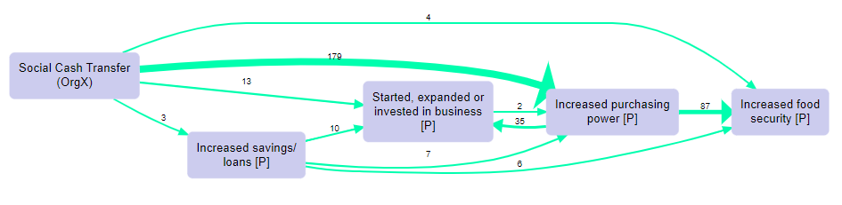

# Overview

{width=650px}

This Guide is for you if:

- you want to find out more about causal mapping as an approach (look for this symbol 📚)
- you want to find out more about the [Causal Map app](https://causalmap.app/) (look for this symbol 💻)
- you are on, or have completed, the [QuIP](https://bathsdr.org/about-the-quip/) Lead Evaluator training

------

If you are in a hurry (and who isn't?), look for overview sections and subsections marked with a ⚡.

::: {.rmdnote}

This Guide accompanies Causal Map 2, the new version of Causal Map, and is valid from September 2021. 

The [old version of this Guide](http://guide2.causalmap.app.s3-website.eu-west-2.amazonaws.com/) covers the old version of Causal Map (the one hosted at go.causalmap.app). 

:::

## License {.unnumbered}

This guide is licensed to you under [Creative Commons Attribution-NonCommercial-NoDerivatives 4.0 International License](http://creativecommons.org/licenses/by-nc-nd/4.0/).

